<p align="center">
  
</p>

<h1 align="center">OpenSail</h1>

<p align="center">
OpenSail is the open-source alternative to Codex App, Claude Desktop, Cursor, and Cowork for agentic software work.<br />
<p align="center">
  <a href="https://docs.tesslate.com"><strong>Docs</strong></a> ·
  <a href="https://docs.tesslate.com/quickstart"><strong>Quickstart</strong></a> ·
  <a href="https://discord.gg/DkzMzwBTaw"><strong>Discord</strong></a> ·
  <a href="https://github.com/TesslateAI/opensail/releases"><strong>Releases</strong></a>
</p>

<p align="center">
Build AI apps, agents, workflows, and automations you can inspect, run, share, and own.<br />
Turn recurring work from Slack, email, spreadsheets, tickets, approvals, and internal tools into runnable software.<br />
Manage your fleet of agents. Connect real systems. Add approvals, budgets, permissions, logs, schedules, and human review.<br />
Run it on your infrastructure. Use any model. Open source. Your cloud, your code, your control.
</p>


<p align="center">
  <a href="#"></a>
  <a href="#"></a>
  <a href="#"></a>
  <a href="https://discord.gg/DkzMzwBTaw"></a>
</p>

---

OpenSail is an open platform for building, running, and sharing AI workflows, apps, agents, and automations you can inspect and own.

It is for anyone with a process that keeps coming back: a founder chasing follow-ups, an operator buried in handoffs, a lawyer managing intake and documents, a support team routing issues, a developer building internal tools, or a company giving people a sanctioned place to build useful AI.

Start with a workflow in plain English: "every morning, check these sources, summarize what changed, update Linear, and send the result to Slack." OpenSail turns that into a real runnable system with a trigger, an agent or app action, selected tools and connectors, delivery targets, approval gates, budget limits, run history, and a sandboxed workspace when the workflow needs files, code, or services.

For builders, OpenSail is a way to turn useful AI experiments into durable software. For leaders, it is a control plane for letting teams move fast while keeping data, infrastructure, cost, permissions, and auditability under control.

Under the hood, OpenSail runs on portable, snapshot-backed workspaces. Agents and apps can sleep when idle, wake when needed, keep state across runs, and move from your local desktop to your own cloud with the same project state intact.

---

## What OpenSail Helps You Run

OpenSail workflows can be scheduled, triggered, connected, approved, budgeted, tracked, packaged, and reused. The goal is durable AI software your team can trust.

Start small:

- Run a task on a schedule, from a button, from a webhook, from Slack or email, or when an app event happens
- Assign the work to an agent, an installed app action, or a lightweight connector-only automation
- Use built-in builder agents to create agents, wire connectors, and attach schedules from chat
- Give the agent only the skills, tools, connectors, and apps it needs for that job
- Connect business systems like Slack, Linear, GitHub, Salesforce, Gmail, internal APIs, and MCP servers
- Send the result to Slack, email, a webhook, the OpenSail inbox, or another app

Add control when the work gets serious:

- Require approval before risky actions happen, then approve from Slack, email, or the web app
- Pause and resume runs at approval boundaries while the system keeps processing other work
- Set per-run and daily budgets so AI and compute spend stays bounded
- See what ran, what it cost, what systems it touched, what it produced, and who approved it
- Keep credentials safe behind the Connector Proxy so apps use tools through scoped runtime calls
- Let lightweight jobs stay cheap, and give heavier jobs a real workspace when they need files, code, terminals, databases, or running services

Package what works:

- Publish a workspace project as an installable app
- Expose typed actions, views, and data resources that other apps, agents, and dashboards can reuse
- Install an app and run one of its actions inside an automation
- Let an agent call an app when the job needs structured, reliable work
- Fork useful apps, share them with a team, or turn them into reusable building blocks

Examples:

- **Software Request Reviewer** - checks new tool requests against policy, budget, security requirements, and approved vendors, then files the next step
- **Product Feedback Router** - watches support, Slack, GitHub, and customer calls, groups recurring pain, and turns it into tickets and weekly summaries
- **Weekly Metrics Reporter** - pulls data every Friday, creates charts, writes the story, and sends it to the right people
- **Lead Follow-up Agent** - researches inbound leads, scores fit, drafts replies, updates the CRM, and asks before sending anything sensitive
- **Client Intake Assistant** - collects forms, checks missing documents, drafts kickoff notes, and keeps status visible
- **Billing Review Workflow** - compares activity, matter context, invoices, and payment status so teams catch leakage before it becomes a write-off
- **Third-Party Risk Manager** - researches vendors, checks policy and reputational risk, produces a structured report, and keeps the approval trail
- **Multi-container Internal App** - ships a real frontend, backend, database, agent, and dashboard as one installable app

OpenSail is for developers, operators, founders, legal teams, support teams, and anyone who can describe the work, knows what "good" looks like, and needs a safe way to make AI do it again tomorrow.

<p align="center">
  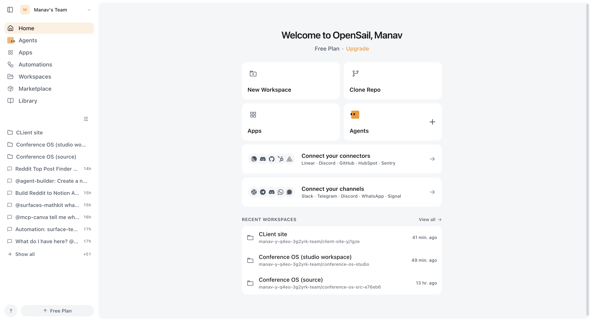
</p>

---

## Agents

Give recurring work a capable owner, then manage your fleet as it grows.

<p align="center">
  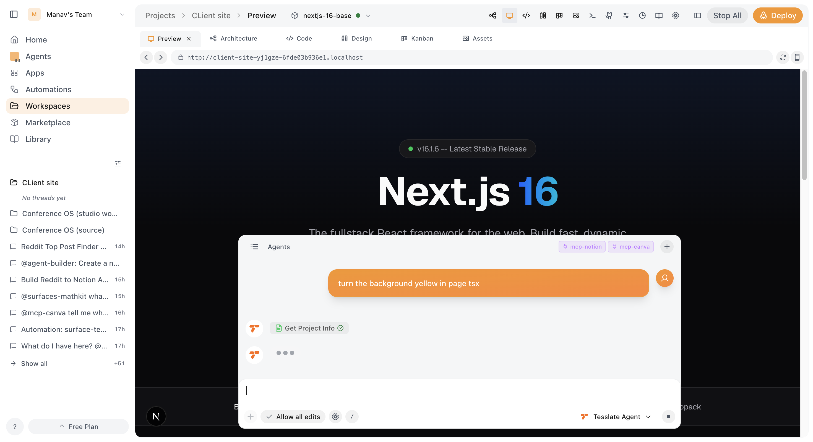
</p>

OpenSail agents are built for the messy jobs that move through files, apps, people, approvals, and business systems. Describe the outcome, attach the tools it needs, set the rules for when it should ask, and let it work from a real sandboxed workspace with source, state, terminals, connectors, schedules, and run history.

An agent can research a lead, prepare a client intake packet, route product feedback, update a CRM, review a vendor request, build an internal tool, fix a bug, generate a report, or call an installed app when the job needs a structured function. It can start from chat, Slack, email, webhook, schedule, app event, or API call, then send results back where people already work.

**Built for finished work.** Agents operate inside real workspaces with files, terminals, containers, previews, Git, artifacts, and deploy targets. They can inspect context, make changes, run commands, call tools, invoke app functions, and leave behind a reviewable trail.

**Made for background workflows.** Schedule agents for daily reports, weekly reviews, customer follow-ups, support triage, billing checks, or monitoring tasks. Each run has a trigger, status, outputs, cost, touched systems, and approval history.

**Context that travels.** Agents carry the right instructions, skills, connectors, MCP servers, model settings, budget, and tool permissions into each run. The work lives with the workspace, so a useful agent can be forked, improved, shared, and reused.

**Manage your fleet of agents.** Put frontend, backend, test, ops, research, and review agents in the same workspace. Assign each one a job, give it the right tools, and let the architecture panel show how the software, agents, containers, secrets, and deploy targets connect.

**Human control at the right moments.** Scope what agents can touch, require approval for sensitive steps, cap spend per run or per day, and inspect the full record after the work completes.

Agents are how OpenSail turns personal process knowledge into durable software. The person closest to the work can describe what should happen, and the platform turns that into something that runs, improves, and scales.

<p align="center">
  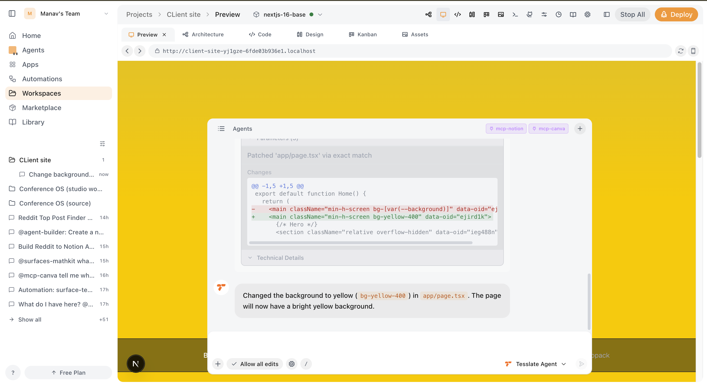
</p>

---

## Apps

One workspace in. One installable app out.

<p align="center">
  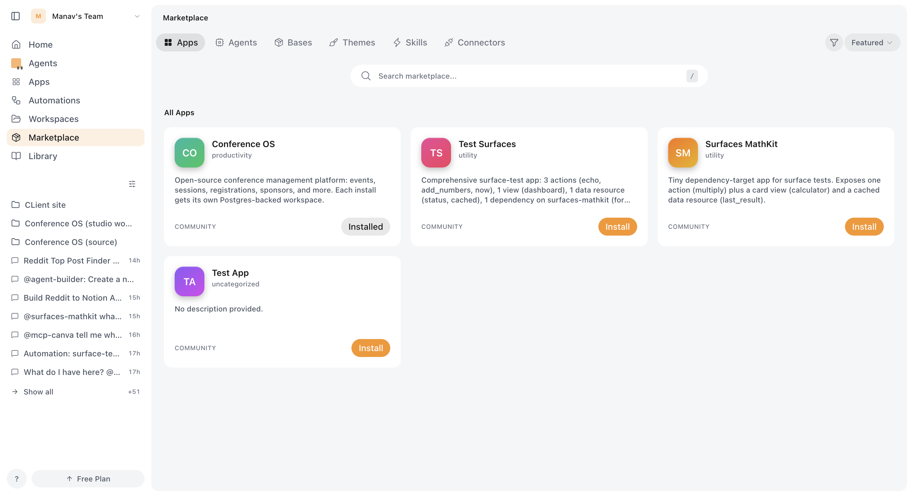
</p>

An app on OpenSail is a versioned, manifest-described bundle. Build it in a workspace, publish it, and anyone can install it with one click. Each install creates a new isolated project with its own volume, containers, runtime contract, permissions, and billing policy.

**The lifecycle:** build in a workspace, publish a content-addressed version, pass the approval pipeline, list on the marketplace or keep it private/team-only, install per-user, run, update, fork.

**Functions:** Apps expose typed actions: JSON-schema-validated functions that agents, automations, dashboards, or other apps can call. An action can call an HTTP handler, run a Kubernetes Job, or invoke a hosted agent. Inputs and outputs are validated, artifacts can be persisted, result templates can format the response, and spend is recorded per invocation.

**Views:** Apps expose embeddable views for cards, drawers, and full pages. Dashboards can compose views from other installed apps through signed embed tokens and scoped grants.

**Data resources:** Apps expose cached, typed reads backed by actions. A dashboard can ask another app for "current pipeline status" or "last billing review result" and reuse the cached data across runs.

**Dependencies:** Apps can call other apps through positive grants. Parent apps can invoke child app actions, embed child views, and query child data resources while spend rolls up to the parent run.

**Connectors:** Apps declare the external systems they need: Slack, GitHub, Gmail, Linear, Salesforce, internal APIs, MCP servers, OAuth, API keys, and webhooks. Proxy-mode connectors let app code call approved services while OpenSail handles secrets, scopes, rotation, and consent.

**Automation templates:** Apps can ship recommended schedules, manual buttons, and webhook triggers. When a user installs the app, selected templates become user-owned automations they can pause, edit, approve, budget, and monitor.

**Billing:** The creator decides who pays. Each billing dimension (AI compute, general compute, platform fee) can be set independently to creator-pays, installer-pays, platform-subsidized, or BYOK (bring your own key, routed directly to your provider). Promotional budgets let creators sponsor the first N users, then flip to installer-pays when the fund runs out. Caps and overage behavior are per-dimension.

**Approval pipeline:** Every published version goes through staged review before it reaches the public marketplace. Automated scans review OAuth scopes, source patterns, dependency posture, and credential handling. Sandbox evaluations run the app against synthetic inputs to measure reliability, cost behavior, and prompt-injection resilience. Human reviewers handle the final sign-off. Private and team installs use a faster internal path, so your first apps ship quickly.

**Forking:** If the creator allows it, anyone can fork an app. Fork creates a new workspace with full source access and a `forked_from` provenance link. The marketplace shows fork trees. A lawyer takes a starter "intake" app, forks it to "intake-estate-planning," and republishes for their firm.

**Bundles:** Group multiple apps into a starter pack. "Install Lawyer Starter" installs 10 apps with consolidated OAuth consent (one Gmail authorization covers all of them), sane defaults, and a dashboard app at the center that embeds the others via signed iframes.

<p align="center">
  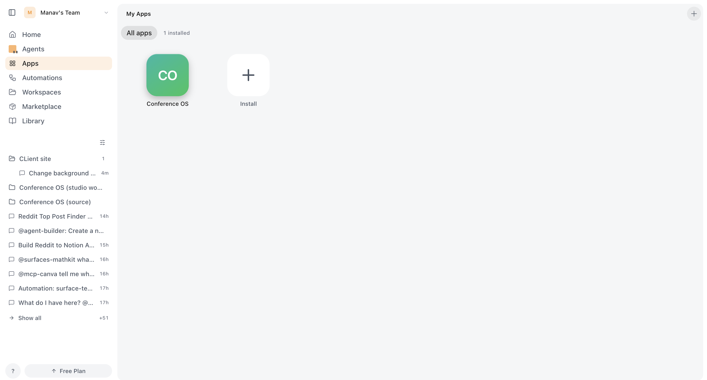
</p>

---

## Automation Runtime

Triggers, agents, apps, delivery, approvals, and spend in one runtime.

<p align="center">
  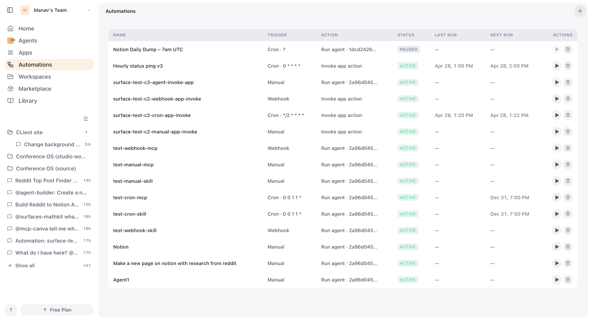
</p>

OpenSail's Automation Runtime is the durable execution layer for work that keeps happening. It turns a schedule, webhook, manual run, app event, or channel message into an event, creates a run, executes actions, records artifacts and spend, and delivers the result.

The mental model is `Trigger -> Event -> Run -> Action -> Delivery`: `agent.run` sends work to a selected agent, `app.invoke` calls an installed app function, and `gateway.send` delivers the output.

**Triggers:** Start workflows from cron schedules, manual buttons, webhooks, app events, Slack, email, or other connected channels.

**Actions:** Run an agent, invoke an installed app function, or send a result through the gateway. Lightweight runs stay in Tier 0. Work that needs files, shell commands, services, or previews can wake a sandboxed workspace.

**Contracts:** Each automation carries an execution contract: allowed tools, allowed MCP servers, allowed apps, compute tier, approval rules, and spend caps. Risky steps pause at approval boundaries and resume from checkpoints after a human decision.

**Delivery:** Send outputs to Slack, email, webhook endpoints, the OpenSail inbox, or another app. Results can include approval cards, reports, structured JSON, files, screenshots, and delivery receipts.

**Observability:** Every run keeps its trigger, status, checkpoint, artifacts, spend, touched systems, and approval trail visible to the user who owns it.

---

## Build Automations and Agents Autonomously

Describe the system you want, and let OpenSail draft the agent, automation, connectors, schedule, permissions, and review flow.

<p align="center">
  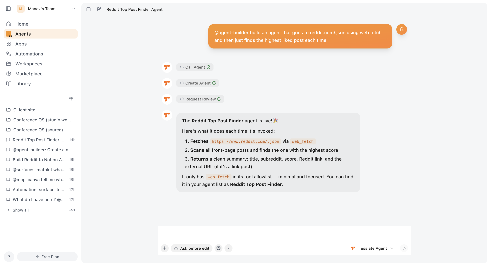
</p>

OpenSail includes built-in agents that help people turn intent into reusable team assets.

**Agent Builder:** Mention `@agent-builder`, describe the agent you want, and it drafts a user-owned agent with a name, instructions, model preference, connected MCP servers, skills, and tool permissions. It uses the user's installed resources, produces a review card, and publishes after approval.

**Automation Builder:** Mention `@automation-builder`, choose one of your existing agents, describe the schedule and output target, and it drafts a user-owned automation. It attaches the cron trigger, prompt template, delivery targets, compute tier, and spend cap, then waits for the publish-and-activate review.

**Service Integrator:** Use the Service Integrator agent to connect services, configure MCPs and channels, and make sure agents have the tools they need before a workflow goes live.

These builders make the marketplace practical for everyday teams: build an agent, attach the right systems, schedule it, review it, and share it from the same chat surface.

<p align="center">
  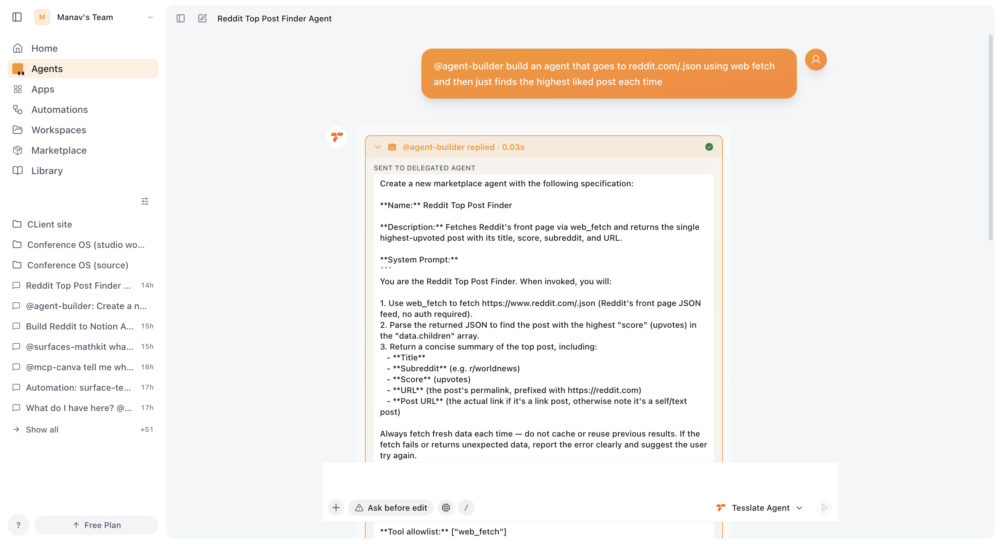
</p>

---

## Workspaces

Fork a running environment in seconds.

<p align="center">
  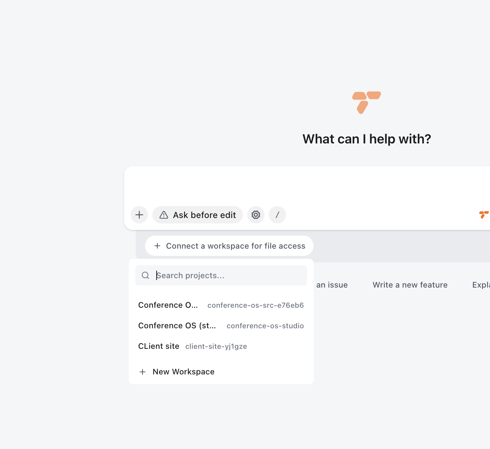
</p>

Every agent, app, and workflow runs inside a workspace. One workspace = one app. Multiple agents can collaborate inside the same workspace (frontend agent, backend agent, test agent working on the same codebase), but the workspace publishes as a single unit.

Workspaces are built on BtrFS, a snapshot-based filesystem that makes everything fast, portable, and persistent.

**Instant snapshots.** Fork a workspace in seconds. Roll back to any point in time. Branch off a working agent to try something new while the current version keeps serving users. Up to 5 snapshots retained per project for a built-in timeline.

<p align="center">
  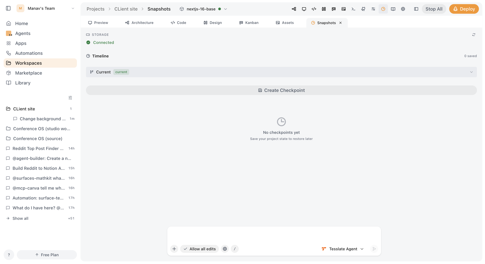
</p>

**Desktop to cloud.** Connect your local OpenSail instance to your own cloud infrastructure. Build locally, push to the cloud, run at scale. Same workspace, same state, smooth handoff.

**Share anything.** Workspaces are self-contained. Share an agent with your team and they get the full environment: code, state, config, dependencies, and runtime settings.

**Stay in control.** You decide what tools and data an agent can use, what actions it can take, and when it needs approval. For sensitive steps, require the agent to ask before moving forward. Analytics show you how agents are being used, how many runs they've completed, and who's using them.

---

## Agentic coding

Code, ship, and operate from the same workspace.

<p align="center">
  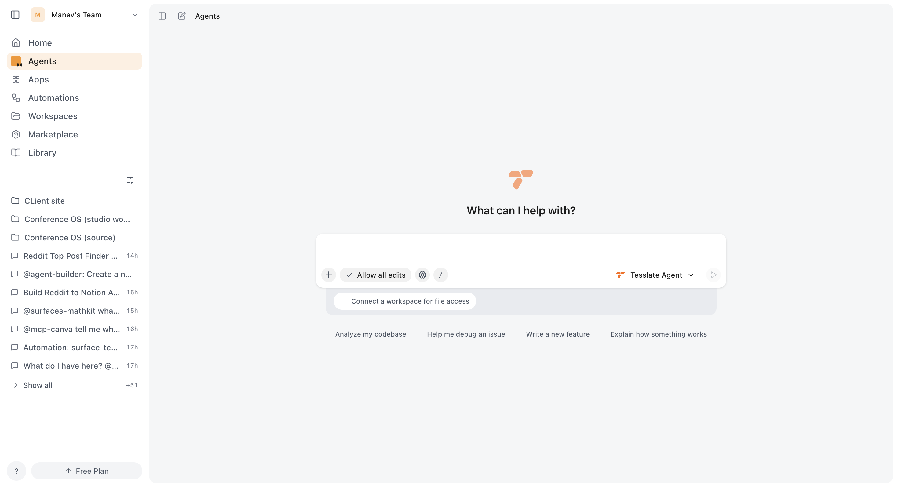
</p>

OpenSail is a full coding environment and product operating surface in one window. You get a real editor, terminal, containers, live preview, deployments, schedules, permissions, run history, and channel integrations. Agents can drive the work, collaborate with you, or hand control back to the human operator.

**Full workspace IDE.** Monaco editor with multi-language syntax support, autocomplete, find-in-files, and refactor support. A terminal attached to the running container. A file tree that mirrors the container's filesystem exactly. Live preview with hot module reload. Git panel with diff, blame, history, and branch switching.

<p align="center">
  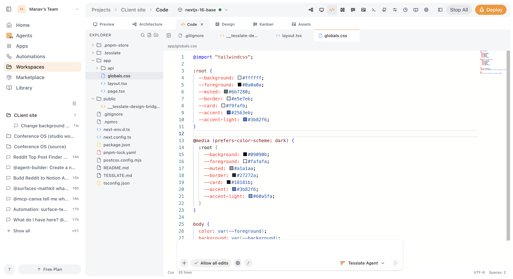
</p>

**Shared context with agents.** The agent sees the same tree, files, shell output, app preview, and architecture graph as you do. Every edit the agent makes is a reviewable diff you can accept, revise, or keep editing. Every command the agent runs shows up in your terminal. The agent's work is your work, in the same checkout.

**Kanban for real work.** Ticket refs like TSK-0001 live on a board inside the project. Drag columns, hand tasks to agents, and watch them close as the work lands. The agent can create tickets, update status, and comment as it goes.

**Ship from the canvas.** Draw an edge from a container to a deploy target. Draw one to a Slack channel. Draw one to a schedule. The same canvas that authors the app authors the ops.

**Governance on by default.** Per-project permissions gate what tools the agent can touch (shell, network, git push, file writes, process spawning). Budget caps throttle AI spend per project and per team. Team roles (admin, editor, viewer) scope who can edit, deploy, or approve. Every significant action writes to an append-only audit log keyed by team and project.

**Long-running context.** When a session crosses 80% of the model's window, the agent progressively compacts older messages with a cheap model and keeps going across multi-hour runs.

**Progressive persistence.** Every agent step streams to the database as it happens. Sessions resume from saved trajectories, checkpoints, and tool results across browser reloads, worker restarts, and network changes.

---

## Design engineer

Click a pixel in your running app, jump to the JSX line that rendered it.

The Design Engineer is a live-editing canvas that runs alongside the code editor. It loads your dev server in an iframe, injects a bridge script into the running app, and turns every rendered element into something you can select, edit, and push back to source.

**Click-to-source.** The bridge walks the React Fiber tree at runtime to resolve any DOM element to its component name, source file, and line number. Click a button in the preview and the editor opens the JSX that produced it.

**Stable OID mapping.** A server-side pass tags JSX elements with `data-oid` attributes so every edit is keyed to the exact source location that rendered it. Refactor a file, move the component, and the mapping survives.

**Two-way, sub-100ms sync.** Edit class names, text, styles, or attributes in the inspector and the change lands in the preview and the source file in one step. Edit the file directly and HMR flows back through the canvas while preserving your selection.

**Full CSS inspector.** Tailwind autocomplete from a curated palette, an interactive box model for margin / padding / border, grouped style sections for layout, size, typography, background, flex, and grid, color pickers, and HTML attribute editing with add / remove.

**Insert palette.** Drag in semantic HTML, project components auto-detected from your PascalCase files (with auto-import hints), or framework patterns tailored to React, Next.js, Vue, Svelte, Angular, or Astro.

**Canvas powers.** Pan and zoom with cursor-anchored math so the point under the cursor stays fixed. Responsive breakpoints from 375px to 1536px. Snap guides. Undo/redo across the whole session with inverse-request replay.

**Structured diffs for the agent.** Canvas edits become typed `CodeDiffRequest` objects (style patch, class override, text content, attributes, structural changes). The agent can see what a user did on the canvas and reason about intent from the structured change.

---

## Architecture Panel

One canvas. One config file. Two authors. Shared state.

<p align="center">
  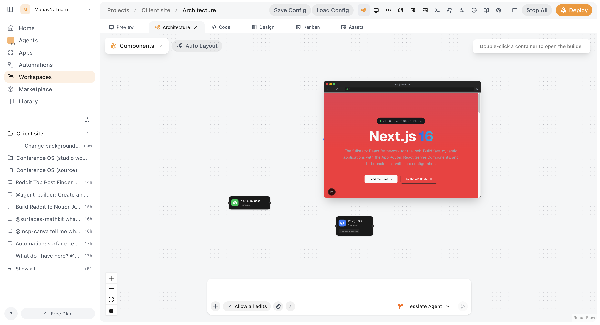
</p>

The Architecture Panel is a visual node-graph canvas built on React Flow where you design, wire, and manage the full topology of your project. Every project has one. It is the single source of truth for what your app is: what containers run, how they connect, where secrets flow, and where the whole thing deploys.

The panel renders `.tesslate/config.json`. Both humans and agents read and write the same file. When the agent adds a Postgres container and wires its `DATABASE_URL` into the backend, the nodes and edges appear on the canvas in real time. When you drag a new service onto the canvas, the agent sees the updated graph on its next iteration. One file, two authors, shared state.

**Node types on the canvas:**

- **Container nodes** - Your app containers (frontend, backend, workers), color-coded by role: green for base, blue for service, purple for external, cyan for hybrid. Each shows status, port, and tech stack. Click to open the properties panel; double-click to jump into the code editor.
- **Browser preview nodes** - Live iframe windows rendered directly on the canvas. Resizable, with back/forward/home/refresh and a URL bar. You can see your running app while you wire its architecture.
- **Deployment target nodes** - Branded cards for each provider (Vercel, AWS, Cloudflare, etc.) with environment tags, connected containers, and deployment history. Click the env tag to cycle production/staging/preview.
- **Hosted agent nodes** - The TesslateLLM proxy node. Represents a contained agent inside the app: creator configures system prompt, bound tools, bound MCPs, and model preference. At runtime it resolves to a shared worker pool with per-session keys tied to the installer's wallet.

**Edge types (each expresses a different dependency):**

- `env_injection` (orange, dashed) - Source container's exports become target container's environment variables
- `http_api` (blue, solid animated) - HTTP service dependency
- `database` (green, solid) - Persistence dependency
- `cache` (red, dashed) - Redis or memcached
- `browser_preview` (purple, dashed) - Container to preview window
- `deployment` (orange, dashed with arrow) - Container to deployment target

**Why this exists:**

The AI agent needs a structured, parseable, roundtrippable target. The panel gives both humans and agents a typed graph they can read and write. Credentials and secrets are visible in the graph as `env_injection` edges. Multi-container topology is first-class and visible alongside Docker/Kubernetes configuration. For apps, the panel is the authoring surface: publish serializes the graph into the manifest, install restores it into a new project with the same graph.

One canvas. One config file. Agents, humans, secrets, deployments, and apps all share one structured representation.

---

## Turn best practices into shared agents

Turn institutional knowledge into agents the whole team can run.

<p align="center">
  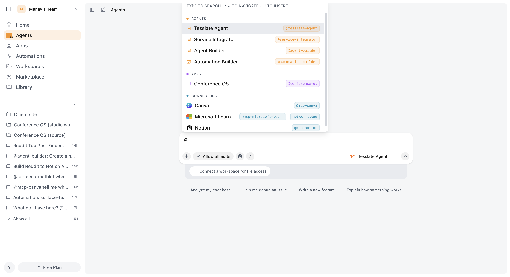
</p>

Knowledge is scattered across people and systems. OpenSail gives teams a way to turn that knowledge into a reusable agent or workflow that follows the right process, uses the right tools, and can be shared across the organization.

Build once, improve through use, then share or duplicate for new workflows. Because agents have memory and can be guided and corrected in conversation, they get better as teams use them.

**Discover what your team has built.** Browse shared agents, apps, and workflows. Fork what works. Build on top of what already exists.

**Collaborate across tools.** Set agents to run on a schedule, or deploy them in Slack so they pick up requests as they come in. Agents join the conversations where work already happens.

**Scale a working process.** Something that works for one person should work for a hundred. OpenSail handles the infrastructure so you can focus on the workflow.

---

## Cloud sandboxes for agents

Run your own sandboxing engine.

<p align="center">
  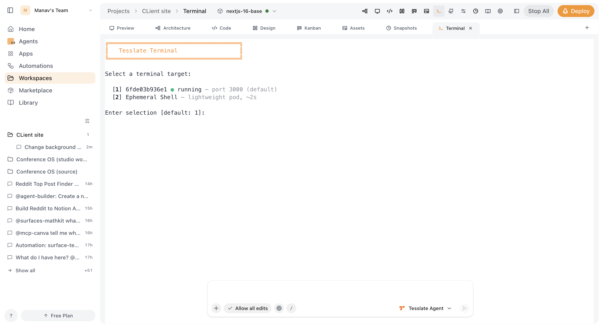
</p>

Running agents means giving them compute. OpenSail provides the infrastructure for cost-aware execution.

The runtime uses a three-tier compute model built on Kubernetes:

| Tier | What runs here | Cost |
|------|---------------|------|
| **Tier 0** | File operations, web calls, agent reasoning | Near zero |
| **Tier 1** | Shell commands via warm ephemeral containers | Execute instantly, return to pool |
| **Tier 2** | Full K8s namespaces with multi-container environments for live previews and deployments | On-demand |

About 99% of agent operations run on the first two tiers. Containers hibernate when idle and wake on demand.

The whole system is backed by a custom CSI driver built on BtrFS that handles snapshot management, S3-backed storage, and backup/restore. Agent workspaces persist independently of any running container and mount on demand across tiers.

**Multi-container by default.** Each project gets its own K8s namespace. Every container gets its own Deployment, Service, and Ingress. Pod affinity pins all containers in a project to the same node so they can share the BtrFS volume. Inter-container networking uses cluster DNS (`backend.proj-abc123.svc.cluster.local:8000`). Infrastructure containers (Postgres, Redis) get their own isolated PVCs. Start a project and the orchestrator creates the namespace, provisions the PVC, deploys the file manager, clones repos, and spins up all containers with readiness probes gating traffic.

**Hibernation is volume-level.** Hibernate a project and it snapshots the entire shared volume, then tears down the namespace. Restore from snapshot and all containers come back together with their files intact. Atomic save and restore for multi-container projects.

<p align="center">
  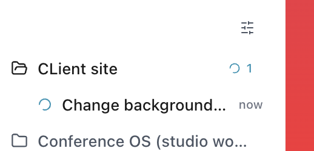
</p>

---

## Gateway API and MCP Server

Rent your compute to other agents.

OpenSail exposes your running instance to the outside world through two interfaces:

**Gateway API:** External users (agents or humans) can interact with your OpenSail instance using an API key. They get their own sandboxed containers, can invoke agents, and run workflows. The API supports webhook callbacks on completion, scoped permissions per key, and project-level isolation.

**MCP Server (in development):** OpenSail itself becomes an MCP tool server. External coding agents (Claude Code, Cursor, Codex, or your own) can connect to your OpenSail instance, get sandboxed compute, use your agents, and publish apps directly from their development environment. Your instance becomes infrastructure that other agents can build on.

---

## Connectors

Every tool your agent needs, already wired.

<p align="center">
  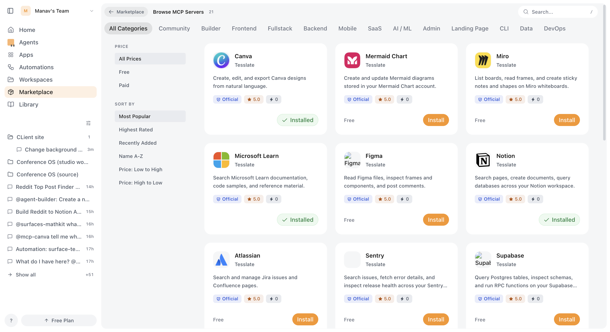
</p>

Agents can gather context and take action across dozens of tools. OpenSail supports MCP (Model Context Protocol) natively.

Plug in Slack, Gmail, Google Drive, Linear, Jira, Notion, GitHub, Salesforce, HubSpot, Confluence, databases, internal APIs, or anything with an MCP server or a REST endpoint.

Connectors are first-class. When you build an agent, you pick the tools it needs, set the permissions, and it just works. Add new connectors while keeping the agent's core instructions stable. MCP tool schemas are cached and bridged into the agent's tool registry automatically.

Build your own connectors for internal systems. Publish them for your team. The protocol is open, so nothing is locked in.

---

## Agent skills

Teach an agent once. Any agent can use it forever.

Skills are reusable capabilities you teach your agents. Package what works into a skill and let the agent use it when it needs to.

Skills are loaded progressively: a lightweight catalog (name + description) is injected into the agent's context, and the full skill body is pulled on demand only when the agent decides to use it. This keeps the context window lean.

Skills can be anything: a data analysis pipeline, a writing style, a code review checklist, a research methodology, a report template. Build them once, attach them to any agent or workflow. Share them on the marketplace.

---

## Desktop App

The full cloud platform, running on your laptop.

OpenSail ships as a native desktop app built on Tauri v2. It runs the exact same orchestrator as the cloud version, locally, with zero network dependency by default. Install and start building with the local runtime.

The desktop app is a Tauri shell wrapping a PyInstaller-frozen FastAPI sidecar. The sidecar binds to localhost on a random port, mints a per-launch bearer token, runs migrations against a local SQLite database, and starts the same server you'd get in the cloud. The frontend is identical. The agent is identical. The tools are identical.

**Three runtimes per project, your choice:**

- **Local** - Subprocesses on your machine with the default local runtime.
- **Docker** - Docker Compose if you have it installed. Full container isolation on your machine.
- **Kubernetes** - Connect to a remote K8s cluster (your own or Tesslate's cloud). Get sandboxed multi-container environments, BtrFS snapshots, tiered compute, the full infrastructure.

You pick the runtime per project. A personal script can run local. A multi-container app can run on Docker. A production workflow can run on your own K8s cluster. Same UI, same agent, same workspace for all three.

**Cloud pairing.** Pair your desktop app to a cloud instance (Tesslate's or your own self-hosted cluster) and you get Codex-style cloud sandboxing from your own machine. Your projects sync bidirectionally. Build locally, push to the cloud, run at scale. Pull results back down. The desktop stays your home base, the cloud is your compute.

**What lives on your machine:**

```
$OPENSAIL_HOME/
├── projects/{slug}-{uuid}/     # your project files
├── cache/                       # cloud token, marketplace cache, port allocations
├── agents/{slug}/manifest.json  # installed agents
├── skills/{slug}/manifest.json  # installed skills
├── logs/
└── opensail.db                    # local SQLite database
```

One folder. Wipe it, you get a clean install.

**Offline-first marketplace.** Agents, skills, bases, and themes install locally from the cloud marketplace with SHA-256 verified downloads. Once installed, they work offline. Local items and cloud items merge, local wins by slug. Cache is stale-while-revalidate with background refresh.

**Permissions per project.** Each project has a `.tesslate/permissions.json` that gates what agents can do: shell access, network calls, git push, file writes, process spawning. Three policies per capability: `allow` (silent), `deny`, `ask` (approval prompt in the tray, TUI, or browser). "Always allow" persists your decision back to the file. Budget caps with monthly limits and alert thresholds are built in.

**Approval workflow.** When an agent hits a gated tool, the desktop shows a tray notification with an approval card. Approve, deny, or "always allow" for that tool. Human-readable ticket refs (TSK-0001, TSK-0002) so you can track what the agent asked for and what you approved.

**Adopt existing folders.** Point OpenSail at any directory on your machine and it becomes a project. POSIX uses symlinks; Windows writes a marker file. Git root detection groups sessions by repo automatically. One agent session can span multiple directories.

---

## Model Providers

One agent. Every model.

OpenSail is model-agnostic. All model calls route through LiteLLM. Switch providers while keeping your agents intact.

**Supported providers:**

| Provider | 
|----------|
| **Anthropic** |
| **OpenAI** | 
| **DeepSeek** |
| **Meta** | 
| **Mistral** | 
| **Qwen** | 
| **Google** | 
| **Moonshot** | 
| **MiniMax** |
| **Z.AI (ChatGLM)** |
| **xAI** |

**BYOK (Bring Your Own Key):** Attach your own API key from OpenAI, Anthropic, OpenRouter, Groq, Together, DeepSeek, Fireworks, or any OpenAI-compatible endpoint. BYOK routes model usage to your provider account. Your key, your cost, your provider.

**Self-hosted models:** Point LiteLLM at Ollama, vLLM, or any local inference server. Run fully air-gapped with open-weight models on your own hardware.

---

## Deployment targets

Ship to 22 places by drawing an edge.

Deploy from the Architecture Panel. Draw an edge from a container to a deployment target. A/B deployments work naturally: connect the same container to two targets (Vercel for production, Cloudflare for preview) and each gets independent deployment history and rollback.

**22 supported targets:**

| Category | Targets |
|----------|---------|
| **Serverless / Full-stack** | Vercel, Netlify, Cloudflare Pages, DigitalOcean App Platform, Railway, Fly.io, Heroku, Render, Koyeb, Zeabur, Northflank |
| **Static hosting** | GitHub Pages, Surge, Deno Deploy, Firebase Hosting |
| **Container push** | AWS App Runner, GCP Cloud Run, Azure Container Apps, DigitalOcean Container Apps |
| **Registry / Export** | Docker Hub, GitHub Container Registry (GHCR), Download/Export (zip) |

Each target is a registry entry. Adding a new provider is one config block.

---

## Communication gateways

Deploy agents where your team already talks.

<p align="center">
  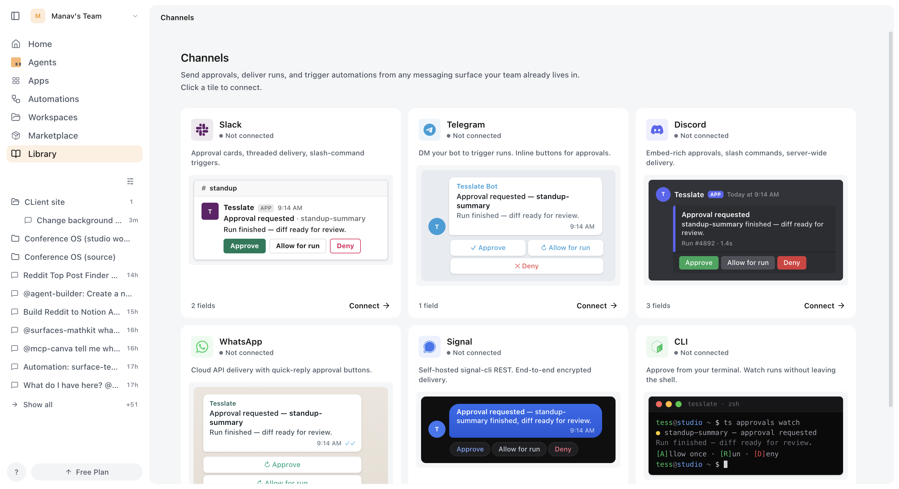
</p>

Deploy agents to the channels where your team already works. Each channel is a `GatewayAdapter` subclass, hot-reloaded via Redis pub/sub.

| Channel | Description |
|---------|-------------|
| **Slack** | Agents respond in channels, pick up requests, post reports |
| **Telegram** | Full bot integration with message handling |
| **Discord** | Server and DM support |
| **WhatsApp** | Business API integration |
| **Signal** | Secure messaging support |
| **CLI WebSocket** | For headless usage, external agents, and the Tesslate TUI |

Set agents to run on a schedule, or let them listen for messages and respond as they come in. Delivery routing supports per-schedule targets: origin, telegram:chat_id, discord:channel_id, and more.

---

## Themes and whitelabel

Make OpenSail look like your platform.

<p align="center">
  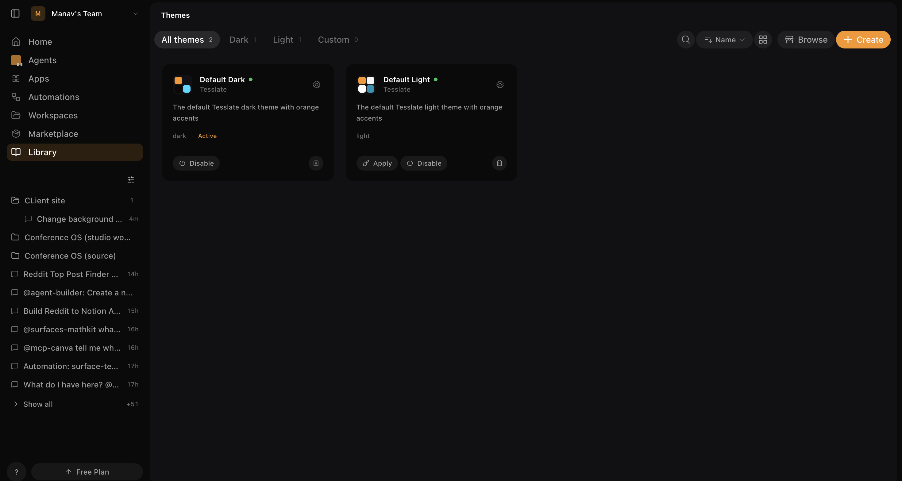
</p>

OpenSail ships with a theme system that lets you restyle the entire UI — colors, typography, spacing, animations — without touching code. Pick a theme from the marketplace, install it locally, or author your own. The same theme presets travel across desktop and cloud.

<p align="center">
  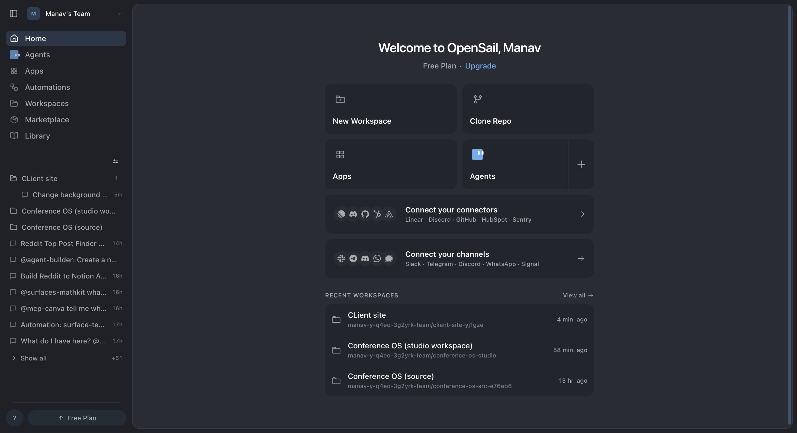
</p>

**Whitelabel for your team.** Run OpenSail as your company's all-in-one AI platform. Apply your brand, set internal defaults, curate the marketplace your team sees, and give everyone a single sanctioned place to build agents, apps, and automations. Same software, your identity.

---

## Why open source

Your data. Your models. Your infrastructure.

Workspace agents are powerful. They touch your data, your tools, your processes. You should be able to see exactly what they're doing, run them on your own infrastructure, and choose the model provider that fits the work.

OpenSail runs on any model. Switch providers while keeping your agents intact. Deploy on-prem, air-gapped, or on any cloud. Keep data inside your network.

OpenSail is open-source infrastructure you can operate directly. Your infrastructure, your cost structure.

---

## Run OpenSail

Pick the path that matches what you are trying to do. OpenSail can run as a simple local Docker stack, as a desktop app, on local Kubernetes for platform testing, or on a production Kubernetes cluster. Those are different levels of commitment for the same product.

| You want to... | Use this path | Best for |
|----------------|---------------|----------|
| Try OpenSail or develop the web app locally | Docker Compose | Most contributors and first-time users |
| Let a script set up macOS dependencies | macOS installer | People who want a guided local setup |
| Run the desktop app | Desktop release or desktop dev mode | Local-first workflows and desktop packaging work |
| Test the real Kubernetes runtime locally | Minikube | Platform/runtime contributors |
| Run your own production instance | AWS EKS Terraform + Kustomize | Teams operating OpenSail in their own cloud |

### Docker Compose

This is the most realistic first run for most people. It starts the frontend, backend, worker, gateway, Postgres, Redis, Traefik, and the devserver image used by user project containers.

Use Docker Desktop on macOS or Windows, Docker Engine on Linux, or Colima on macOS. On Windows, run the commands from WSL2 so bind mounts and project paths behave like Linux paths.

```bash
git clone https://github.com/TesslateAI/opensail.git
cd opensail
cp .env.example .env
```

Edit `.env` before first boot:

- `SECRET_KEY` should be a real random value.
- `LITELLM_API_BASE` and `LITELLM_MASTER_KEY` are needed for agent/model calls. A working model proxy gives you the full agent experience.

Then start the stack:

```bash
docker compose up --build -d
docker compose ps
```

Open `http://localhost`. API docs are at `http://localhost:8000/docs`.

The fuller Docker walkthrough is in [docs/guides/docker-setup.md](docs/guides/docker-setup.md). After your first setup, the helper script is handy:

```bash
./scripts/docker.sh start
./scripts/docker.sh status
./scripts/docker.sh logs backend
```

### Guided macOS Setup

If you are on macOS and want the repo to help install local tooling, use the interactive installer. It installs Homebrew dependencies, starts Colima, helps create `.env`, and lets you choose Docker Compose or Minikube.

```bash
git clone https://github.com/TesslateAI/opensail.git
cd opensail
./scripts/install-macos.sh
```

Use Docker Compose unless you specifically need Kubernetes behavior.

### Desktop App

The desktop app is local-first. The default local runtime uses your machine directly, with Docker and Kubernetes available as optional project runtimes. It is a Tauri shell around the same React frontend and FastAPI orchestrator, with a local SQLite database under `OPENSAIL_HOME`.

If a signed installer is attached to a release, that is the easiest path for non-server users: install it like any other desktop app and start building locally.

If you are working on the desktop app itself or building local installers from source:

```bash
git clone https://github.com/TesslateAI/opensail.git
cd opensail
./desktop/scripts/dev.sh
```

The desktop toolchain needs Rust, Node 20+, pnpm, `uv`, and Tauri dependencies. See [docs/desktop/development.md](docs/desktop/development.md) for the exact setup and installer build steps.

### Local Kubernetes With Minikube

Use Minikube when you need to test the Kubernetes runtime: namespaces, ingress, Volume Hub, btrfs CSI, snapshots, MinIO-backed object storage, worker behavior, and project containers. Docker Compose gives the fastest first run; Minikube gives the closest local platform test.

```bash
git clone https://github.com/TesslateAI/opensail.git
cd opensail
./scripts/minikube.sh init
```

Edit the generated secret files under `k8s/overlays/minikube/secrets/`, `k8s/overlays/minikube/minio/`, and `services/btrfs-csi/overlays/minikube/`. Then:

```bash
./scripts/minikube.sh start
./scripts/minikube.sh tunnel
```

Leave the tunnel running and open `http://localhost`. The complete step-by-step guide is [docs/guides/minikube-setup.md](docs/guides/minikube-setup.md).

### Production / Self-Hosted Kubernetes

The repo-supported production path is Terraform for cloud infrastructure and Kustomize for Kubernetes manifests.

The maintained production-class path is AWS EKS:

```bash
./scripts/terraform/secrets.sh download shared
./scripts/aws-deploy.sh terraform shared

./scripts/terraform/secrets.sh download beta
./scripts/aws-deploy.sh terraform beta
./scripts/aws-deploy.sh build beta
./scripts/aws-deploy.sh deploy-k8s beta
```

Use `production` after validating the flow in `beta`.

For non-EKS clusters, treat `k8s/base/` and the overlays as the starting point. Provide the same real pieces yourself: image registry, ingress controller, TLS/DNS, object storage, Postgres/Redis strategy, secrets, storage class, snapshot support, and the Volume Hub/btrfs CSI layer. The EKS guide is the best reference for the required production shape: [docs/guides/aws-deployment.md](docs/guides/aws-deployment.md).

---

## Architecture

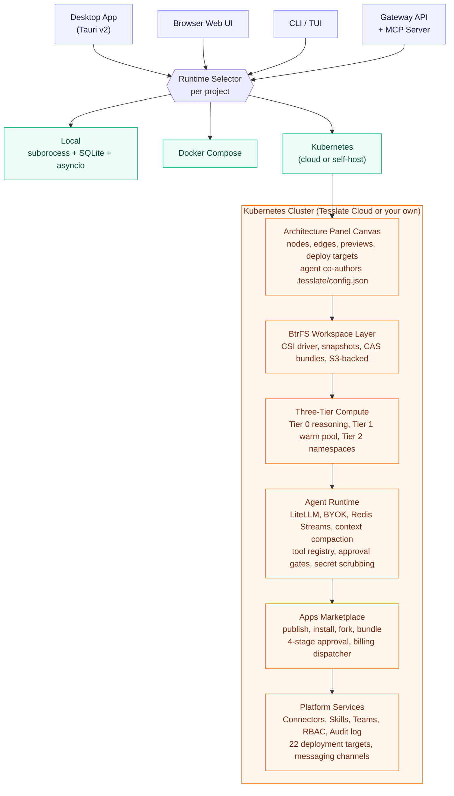
```mermaid
flowchart TB
    D["Desktop App<br/>(Tauri v2)"] --> R
    B["Browser Web UI"] --> R
    C["CLI / TUI"] --> R
    G["Gateway API<br/>+ MCP Server"] --> R

    R{{"Runtime Selector<br/>per project"}}

    R --> L["Local<br/>subprocess + SQLite + asyncio"]
    R --> DC["Docker Compose"]
    R --> K["Kubernetes<br/>(cloud or self-host)"]

    subgraph K8S["Kubernetes Cluster (Tesslate Cloud or your own)"]
        direction TB
        AP["Architecture Panel Canvas<br/>nodes, edges, previews, deploy targets<br/>agent co-authors .tesslate/config.json"]
        WS["BtrFS Workspace Layer<br/>CSI driver, snapshots, CAS bundles, S3-backed"]
        TC["Three-Tier Compute<br/>Tier 0 reasoning, Tier 1 warm pool, Tier 2 namespaces"]
        AR["Agent Runtime<br/>LiteLLM, BYOK, Redis Streams, context compaction<br/>tool registry, approval gates, secret scrubbing"]
        MK["Apps Marketplace<br/>publish, install, fork, bundle<br/>4-stage approval, billing dispatcher"]
        PS["Platform Services<br/>Connectors, Skills, Teams, RBAC, Audit log<br/>22 deployment targets, messaging channels"]

        AP --> WS
        WS --> TC
        TC --> AR
        AR --> MK
        MK --> PS
    end

    K --> AP

    classDef surface fill:#eef2ff,stroke:#6366f1,color:#1e1b4b;
    classDef runtime fill:#ecfdf5,stroke:#10b981,color:#064e3b;
    classDef cluster fill:#fff7ed,stroke:#f97316,color:#7c2d12;
    class D,B,C,G surface;
    class L,DC,K runtime;
    class AP,WS,TC,AR,MK,PS cluster;
```

Kubernetes installs currently use Kustomize overlays. For local cluster testing, use [Minikube](docs/guides/minikube-setup.md). For production on AWS, use the Terraform and deployment helpers in [docs/guides/aws-deployment.md](docs/guides/aws-deployment.md). Pair desktop apps to a cloud instance when you want local-first control with cloud sandboxing behind it.

## Contributing

We're building this in the open. Contributions are welcome.

Check out the [contributing guide](CONTRIBUTING.md) for development setup and how to submit PRs. Join the [Discord](https://discord.gg/DkzMzwBTaw) to talk about what you're building or what you'd like to see.

---

## Community

- [Discord](https://discord.gg/DkzMzwBTaw) - Ask questions, share what you're building
- [GitHub Discussions](https://github.com/TesslateAI/opensail/discussions) - Feature requests and ideas
- [Issues](https://github.com/TesslateAI/opensail/issues) - Bug reports

---

## License

Apache 2.0. See [LICENSE](LICENSE).

---

<p align="center">
  <sub>Built by <a href="https://tesslate.com">Tesslate</a></sub>
</p>

---
