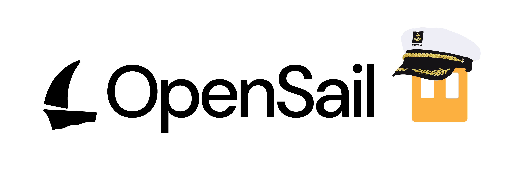
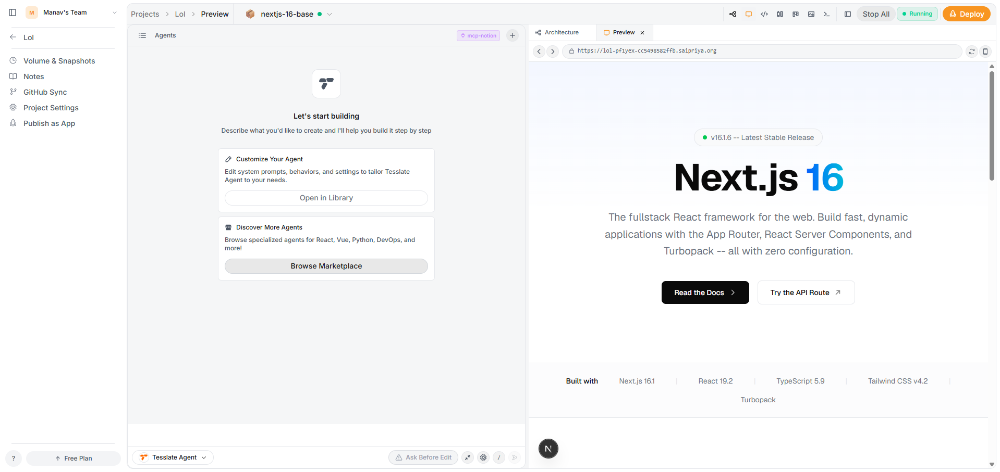
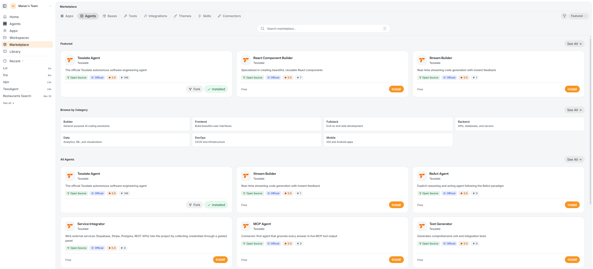
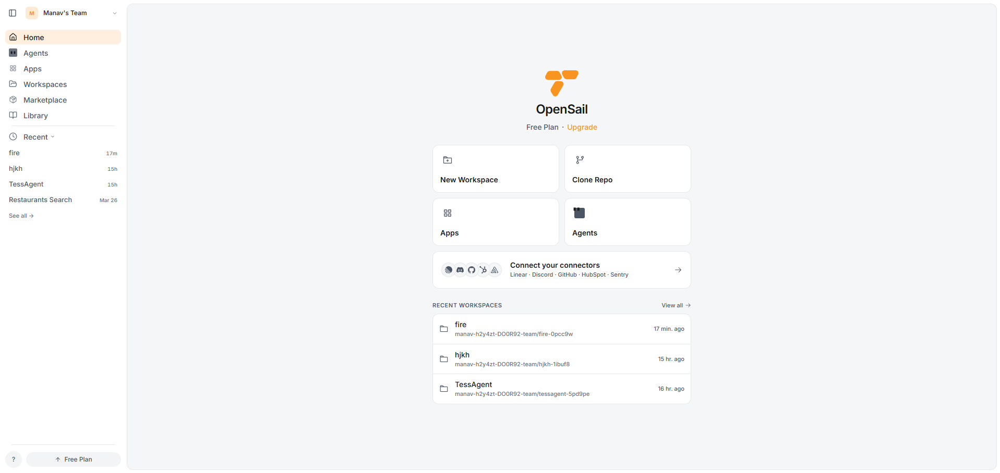
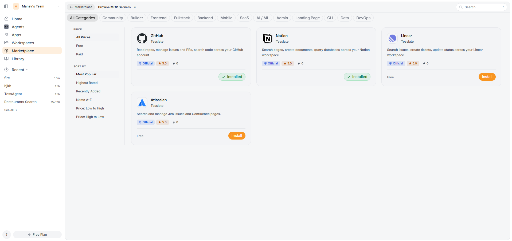

<p align="center">
  
</p>

<h1 align="center">OpenSail</h1>

<p align="center">Build agents, apps, and automations from anywhere.<br />Run them on your infrastructure. Share them across your team.<br />Open source. Any model. No lock-in.</p>

<p align="center">
  <a href="https://opensail.dev/docs"><strong>Docs</strong></a> ·
  <a href="https://opensail.dev/quickstart"><strong>Quickstart</strong></a> ·
  <a href="https://discord.gg/tesslate"><strong>Discord</strong></a> ·
  <a href="https://github.com/TesslateAI/opensail/releases"><strong>Releases</strong></a>
</p>

<p align="center">
  <a href="#"></a>
  <a href="#"></a>
  <a href="#"></a>
  <a href="#"></a>
  <a href="https://discord.gg/tesslate"></a>
</p>

---

OpenSail is an open platform for building, running, and sharing AI-powered software. Build an agent that does your job for you. Turn it into an app. Share it with your team. Deploy it to hundreds of users. Connect it to everything.

It runs on a snapshot-based filesystem that makes workspaces portable, shareable, and persistent. Connect your local desktop to your own cloud. Run agents in sandboxed environments that cost almost nothing when idle. Ship workflows that keep working while you sleep.

OpenSail also exposes a Gateway API and an MCP server (in development), so external agents and humans can interact with your running instance using an API key. They get their own sandboxed containers, can use agents, and publish apps (coming soon) directly from their own coding tools.

<p align="center">
  
</p>

---

## What you can build

Describe the job you want done or drop in a file. OpenSail helps turn it into a working agent, app, or workflow: defining the steps, connecting the right tools, adding skills, and testing it until it works the way you expect.

An "app" on OpenSail is anything you build and ship: a piece of software, an agent, a scheduled automation, a triggered webhook handler, or an MCP tool that other agents can call. Every app is a versioned, installable bundle produced from a workspace project.

Agents do more than answer a prompt. They can write and run code, use connected apps, remember what they've learned, and continue work across multiple steps. They run in sandboxed cloud environments and keep going even when you close your laptop.

A few things people are building today:

- **Software Reviewer** - Reviews employee software requests, checks them against approved tools and policies, recommends next steps, and files tickets when needed
- **Product Feedback Router** - Monitors Slack, support channels, and public forums, then turns feedback into prioritized tickets and weekly product summaries
- **Weekly Metrics Reporter** - Pulls data every Friday, creates charts, writes the summary, and shares a report with the team
- **Lead Outreach Agent** - Researches inbound leads, scores them against your qualification rubric, drafts personalized follow-ups, and updates your CRM
- **Client Onboarding Agent** - Walks through intake forms, pulls in context from past projects, and drafts a kickoff doc
- **Third-Party Risk Manager** - Researches vendors, assesses sanctions exposure, financial health, and reputational risk, and produces a structured report
- **Multi-container CRM** - Next.js frontend + Node API + Postgres, with an embedded AI chat drawer, deployed as a single installable app

You can also start from templates for finance, sales, marketing, operations, and more.

---

## Architecture Panel

<p align="center">
  
</p>

The Architecture Panel is a visual node-graph canvas built on React Flow where you design, wire, and manage the full topology of your project. Every project has one. It is the single source of truth for what your app is: what containers run, how they connect, where secrets flow, and where the whole thing deploys.

The panel renders `.TesslateAI/config.json`. Both humans and agents read and write the same file. When the agent adds a Postgres container and wires its `DATABASE_URL` into the backend, the nodes and edges appear on the canvas in real time. When you drag a new service onto the canvas, the agent sees the updated graph on its next iteration. One file, two authors, no drift.

**Node types on the canvas:**

- **Container nodes** - Your app containers (frontend, backend, workers), color-coded by role: green for base, blue for service, purple for external, cyan for hybrid. Each shows status, port, and tech stack. Click to open the properties panel; double-click to jump into the code editor.
- **Browser preview nodes** - Live iframe windows rendered directly on the canvas. Resizable, with back/forward/home/refresh and a URL bar. You can see your running app while you wire its architecture.
- **Deployment target nodes** - Branded cards for each provider (Vercel, AWS, Cloudflare, etc.) with environment tags, connected containers, and deployment history. Click the env tag to cycle production/staging/preview.
- **Hosted agent nodes** - The TesslateLLM proxy node. Represents a contained agent inside the app: creator configures system prompt, bound tools, bound MCPs, and model preference. At runtime it resolves to a shared worker pool with per-session keys tied to the installer's wallet.

**Edge types (each expresses a different dependency):**

- `env_injection` (orange, dashed) - Source container's exports become target container's environment variables
- `http_api` (blue, solid animated) - HTTP service dependency
- `database` (green, solid) - Persistence dependency
- `cache` (red, dashed) - Redis or memcached
- `browser_preview` (purple, dashed) - Container to preview window
- `deployment` (orange, dashed with arrow) - Container to deployment target

**Why this exists:**

The AI agent needs a structured, parseable, roundtrippable target. If "what are the containers and how do they connect" lives as free-form prose in chat, every edit requires re-inferring state. The panel gives both humans and agents a typed graph they can read and write. Credentials and secrets are visible in the graph as env_injection edges, not buried in `.env` files. Multi-container topology is first-class instead of hidden in docker-compose YAML. And for apps, the panel is the authoring surface: publish serializes the graph into the manifest, install restores it into a new project with the same graph.

One canvas. One config file. Agents, humans, secrets, deployments, and apps all share one structured representation.

---

## Apps

An app on OpenSail is a versioned, immutable, manifest-described bundle. Build it in a workspace, publish it, and anyone can install it with one click. Each install creates a new isolated project with its own volume, its own containers, and its own permissions.

**The lifecycle:** build in a workspace, publish a version (immutable, content-addressed), go through the approval pipeline, list on the marketplace (or keep private/team-only), install per-user, run, update, fork.

**Surfaces:** Every app declares what shape it takes. A single app can be a UI (full web app), a chat interface, a scheduled job (cron), a triggered webhook handler, or an MCP tool callable by other agents. These are not different products. They are surface declarations in the same manifest.

**Billing:** The creator decides who pays. Each billing dimension (AI compute, general compute, platform fee) can be set independently to creator-pays, installer-pays, platform-subsidized, or BYOK (bring your own key, bypass routing entirely). Promotional budgets let creators sponsor the first N users, then flip to installer-pays when the fund runs out. Caps and overage behavior are per-dimension.

**Approval pipeline:** Every published version goes through staged review before it reaches the public marketplace. Automated agent scans check for overbroad OAuth scopes, known-bad code patterns, leaked secrets, and dependency vulnerabilities. A sandbox evaluation runs the app against synthetic inputs with a cheap model to catch crashes, cost blowouts, and prompt injection vulnerabilities. Then a human reviewer signs off. Private and team installs skip the public listing gate, so your first apps ship immediately.

**Forking:** If the creator allows it, anyone can fork an app. Fork creates a new workspace with full source access and a `forked_from` provenance link. The marketplace shows fork trees. A lawyer takes a starter "intake" app, forks it to "intake-estate-planning," and republishes for their firm.

**Bundles:** Group multiple apps into a starter pack. "Install Lawyer Starter" installs 10 apps with consolidated OAuth consent (one Gmail authorization covers all of them), sane defaults, and a dashboard app at the center that embeds the others via signed iframes.

---

## Turn best practices into shared agents

<p align="center">
  
</p>

Knowledge is scattered across people and systems. OpenSail gives teams a way to turn that knowledge into a reusable agent or workflow that follows the right process, uses the right tools, and can be shared across the organization.

Build once, improve through use, then share or duplicate for new workflows. Because agents have memory and can be guided and corrected in conversation, they get better as teams use them.

**Discover what your team has built.** Browse shared agents, apps, and workflows. Fork what works. Build on top of what already exists instead of starting from scratch.

**Collaborate across tools.** Set agents to run on a schedule, or deploy them in Slack so they pick up requests as they come in. Agents join the conversations where work already happens.

**Scale without re-architecting.** Something that works for one person should work for a hundred. OpenSail handles the infrastructure so you can focus on the workflow.

---

## Workspaces

<p align="center">
  
</p>

Every agent, app, and workflow runs inside a workspace. One workspace = one app. Multiple agents can collaborate inside the same workspace (frontend agent, backend agent, test agent working on the same codebase), but the workspace publishes as a single unit.

Workspaces are built on BtrFS, a snapshot-based filesystem that makes everything fast, portable, and persistent.

**Instant snapshots.** Fork a workspace in seconds. Roll back to any point in time. Branch off a working agent to try something new without breaking what's already running. Up to 5 snapshots retained per project for a built-in timeline.

**Desktop to cloud.** Connect your local OpenSail instance to your own cloud infrastructure. Build locally, push to the cloud, run at scale. Same workspace, same state, no re-setup.

**Share anything.** Workspaces are self-contained. Share an agent with your team and they get the full environment: code, state, config, dependencies. Not just a link.

**Stay in control.** You decide what tools and data an agent can use, what actions it can take, and when it needs approval. For sensitive steps, require the agent to ask before moving forward. Analytics show you how agents are being used, how many runs they've completed, and who's using them.

---

## Cloud sandboxes for agents

Running agents means giving them compute. OpenSail provides the infrastructure to do it without burning money.

The runtime uses a patent-pending three-tier compute model built on Kubernetes:

| Tier | What runs here | Cost |
|------|---------------|------|
| **Tier 0** | File operations, web calls, agent reasoning | Near zero |
| **Tier 1** | Shell commands via warm ephemeral containers | Execute instantly, return to pool |
| **Tier 2** | Full K8s namespaces with multi-container environments for live previews and deployments | On-demand |

About 99% of agent operations run on the first two tiers. Containers hibernate when idle and wake on demand.

The whole system is backed by a custom CSI driver built on BtrFS that handles snapshot management, S3-backed storage, and backup/restore. Agent workspaces persist independently of any running container and mount on demand across tiers.

**Multi-container by default.** Each project gets its own K8s namespace. Every container gets its own Deployment, Service, and Ingress. Pod affinity pins all containers in a project to the same node so they can share the BtrFS volume. Inter-container networking uses cluster DNS (`backend.proj-abc123.svc.cluster.local:8000`). Infrastructure containers (Postgres, Redis) get their own isolated PVCs. Start a project and the orchestrator creates the namespace, provisions the PVC, deploys the file manager, clones repos, and spins up all containers with readiness probes gating traffic.

**Hibernation is volume-level.** Hibernate a project and it snapshots the entire shared volume, then tears down the namespace. Restore from snapshot and all containers come back together with their files intact. Atomic save and restore for multi-container projects.

---

## Gateway API and MCP Server

OpenSail exposes your running instance to the outside world through two interfaces:

**Gateway API:** External users (agents or humans) can interact with your OpenSail instance using an API key. They get their own sandboxed containers, can invoke agents, and run workflows. The API supports webhook callbacks on completion, scoped permissions per key, and project-level isolation.

**MCP Server (in development):** OpenSail itself becomes an MCP tool server. External coding agents (Claude Code, Cursor, Codex, or your own) can connect to your OpenSail instance, get sandboxed compute, use your agents, and publish apps directly from their development environment. Your instance becomes infrastructure that other agents can build on.

---

## Connectors

<p align="center">
  
</p>

Agents can gather context and take action across dozens of tools. OpenSail supports MCP (Model Context Protocol) natively.

Plug in Slack, Gmail, Google Drive, Linear, Jira, Notion, GitHub, Salesforce, HubSpot, Confluence, databases, internal APIs, or anything with an MCP server or a REST endpoint.

Connectors are first-class. When you build an agent, you pick the tools it needs, set the permissions, and it just works. Add new connectors without changing your agent's code. MCP tool schemas are cached and bridged into the agent's tool registry automatically.

Build your own connectors for internal systems. Publish them for your team. The protocol is open, so nothing is locked in.

---

## Agent skills

Skills are reusable capabilities you teach your agents. Instead of re-prompting every time, package what works into a skill and let the agent use it when it needs to.

Skills are loaded progressively: a lightweight catalog (name + description) is injected into the agent's context, and the full skill body is pulled on demand only when the agent decides to use it. This keeps the context window lean.

Skills can be anything: a data analysis pipeline, a writing style, a code review checklist, a research methodology, a report template. Build them once, attach them to any agent or workflow. Share them on the marketplace.

---

## Desktop App

OpenSail ships as a native desktop app built on Tauri v2. It runs the exact same orchestrator as the cloud version, locally, with zero network dependency by default. No Docker required. No Kubernetes required. Just install and start building.

The desktop app is a Tauri shell wrapping a PyInstaller-frozen FastAPI sidecar. The sidecar binds to localhost on a random port, mints a per-launch bearer token, runs migrations against a local SQLite database, and starts the same server you'd get in the cloud. The frontend is identical. The agent is identical. The tools are identical.

**Three runtimes per project, your choice:**

- **Local** - Subprocesses on your machine. No containers, no setup. The default.
- **Docker** - Docker Compose if you have it installed. Full container isolation without a cluster.
- **Kubernetes** - Connect to a remote K8s cluster (your own or Tesslate's cloud). Get sandboxed multi-container environments, BtrFS snapshots, tiered compute, the full infrastructure.

You pick the runtime per project. A personal script can run local. A multi-container app can run on Docker. A production workflow can run on your own K8s cluster. Same UI, same agent, same workspace for all three.

**Cloud pairing.** Pair your desktop app to a cloud instance (Tesslate's or your own self-hosted cluster) and you get Codex-style cloud sandboxing from your own machine. Your projects sync bidirectionally. Build locally, push to the cloud, run at scale. Pull results back down. The desktop stays your home base, the cloud is your compute.

**What lives on your machine:**

```
$TESSLATE_STUDIO_HOME/
├── projects/{slug}-{uuid}/     # your project files
├── cache/                       # cloud token, marketplace cache, port allocations
├── agents/{slug}/manifest.json  # installed agents
├── skills/{slug}/manifest.json  # installed skills
├── logs/
└── studio.db                    # local SQLite database
```

One folder. Wipe it, you get a clean install.

**Offline-first marketplace.** Agents, skills, bases, and themes install locally from the cloud marketplace with SHA-256 verified downloads. Once installed, they work offline. Local items and cloud items merge, local wins by slug. Cache is stale-while-revalidate with background refresh.

**Permissions per project.** Each project has a `.TesslateAI/permissions.json` that gates what agents can do: shell access, network calls, git push, file writes, process spawning. Three policies per capability: `allow` (silent), `deny` (blocked), `ask` (approval prompt in the tray, TUI, or browser). "Always allow" persists your decision back to the file. Budget caps with monthly limits and alert thresholds are built in.

**Approval workflow.** When an agent hits a gated tool, the desktop shows a tray notification with an approval card. Approve, deny, or "always allow" for that tool. Human-readable ticket refs (TSK-0001, TSK-0002) so you can track what the agent asked for and what you approved.

**Adopt existing folders.** Point OpenSail at any directory on your machine and it becomes a project. No copying. On POSIX it symlinks; on Windows it writes a marker file. Git root detection groups sessions by repo automatically. One agent session can span multiple directories.

---

## Model Providers

OpenSail is model-agnostic. All model calls route through LiteLLM. Switch providers without rewriting your agents.

**Supported providers:**

| Provider | 
|----------|
| **Anthropic** |
| **OpenAI** | 
| **DeepSeek** |
| **Meta** | 
| **Mistral** | 
| **Qwen** | 
| **Google** | 
| **Moonshot** | 
| **MiniMax** |
| **Z.AI (ChatGLM)** |
| **xAI** |

**BYOK (Bring Your Own Key):** Attach your own API key from OpenAI, Anthropic, OpenRouter, Groq, Together, DeepSeek, Fireworks, or any OpenAI-compatible endpoint. When using BYOK, no platform wallet is charged. Your key, your cost, your provider.

**Self-hosted models:** Point LiteLLM at Ollama, vLLM, or any local inference server. Run fully air-gapped with open-weight models on your own hardware.

---

## Deployment targets

Deploy from the Architecture Panel. Draw an edge from a container to a deployment target. A/B deployments work naturally: connect the same container to two targets (Vercel for production, Cloudflare for preview) and each gets independent deployment history and rollback.

**22 supported targets:**

| Category | Targets |
|----------|---------|
| **Serverless / Full-stack** | Vercel, Netlify, Cloudflare Pages, DigitalOcean App Platform, Railway, Fly.io, Heroku, Render, Koyeb, Zeabur, Northflank |
| **Static hosting** | GitHub Pages, Surge, Deno Deploy, Firebase Hosting |
| **Container push** | AWS App Runner, GCP Cloud Run, Azure Container Apps, DigitalOcean Container Apps |
| **Registry / Export** | Docker Hub, GitHub Container Registry (GHCR), Download/Export (zip) |

Each target is a registry entry. Adding a new provider is one config block, not a UI rewrite.

---

## Communication gateways

Deploy agents to the channels where your team already works. Each channel is a `GatewayAdapter` subclass, hot-reloaded via Redis pub/sub.

| Channel | Description |
|---------|-------------|
| **Slack** | Agents respond in channels, pick up requests, post reports |
| **Telegram** | Full bot integration with message handling |
| **Discord** | Server and DM support |
| **WhatsApp** | Business API integration |
| **Signal** | Secure messaging support |
| **CLI WebSocket** | For headless usage, external agents, and the Tesslate TUI |

Set agents to run on a schedule, or let them listen for messages and respond as they come in. Delivery routing supports per-schedule targets: origin, telegram:chat_id, discord:channel_id, and more.

---

## Why open source

Workspace agents are powerful. They touch your data, your tools, your processes. You should be able to see exactly what they're doing, run them on your own infrastructure, and not be locked to a single model provider.

OpenSail runs on any model. Switch providers without rewriting your agents. Deploy on-prem, air-gapped, or on any cloud. Data never has to leave your network.

No per-seat pricing that scales against you. No credit system that makes you think twice before running an agent. Your infrastructure, your cost structure.

---

## Get started

Clone the repo and run locally:

```bash
git clone https://github.com/TesslateAI/opensail.git
cd opensail
./install.sh
```

Or pull the Docker image:

```bash
docker pull TesslateAI/opensail:latest
docker compose up
```

Then open `http://localhost:3000` and start building.

Read the full setup guide in the [docs](https://opensail.dev/docs).

---

## Architecture

```
┌─────────────────────────────────────────────────────────────────────┐
│                        SURFACES                                      │
│                                                                      │
│  ┌──────────────┐  ┌──────────┐  ┌────────────┐  ┌──────────────┐  │
│  │  Desktop App  │  │  Browser │  │    CLI /   │  │  Gateway API │  │
│  │  (Tauri v2)   │  │   (Web)  │  │    TUI     │  │  + MCP Server│  │
│  └──────┬───────┘  └────┬─────┘  └─────┬──────┘  └──────┬───────┘  │
│         │               │              │                │           │
│         └───────────────┴──────────────┴────────────────┘           │
│                              │                                       │
│                    ┌─────────▼──────────┐                            │
│                    │  Runtime Selector   │                            │
│                    │  (per project)      │                            │
│                    └──┬──────┬───────┬──┘                            │
│                       │      │       │                               │
│            ┌──────────▼┐ ┌───▼────┐ ┌▼────────────────────┐         │
│            │   Local    │ │ Docker │ │    Kubernetes        │         │
│            │ subprocess │ │Compose │ │ (cloud or self-host) │         │
│            │ + SQLite   │ │        │ │                      │         │
│            │ + asyncio  │ │        │ │                      │         │
│            └────────────┘ └────────┘ └──────────────────────┘        │
│                                              │                       │
└──────────────────────────────────────────────┼───────────────────────┘
                                               │
          ┌────────────────────────────────────▼─────────────────────┐
          │              KUBERNETES CLUSTER                           │
          │        (Tesslate Cloud OR your own cluster)               │
          │                                                          │
          │  ┌────────────────────────────────────────────────────┐  │
          │  │            Architecture Panel Canvas                │  │
          │  │  Container nodes · Edges · Previews · Deploy targets│  │
          │  │  Agent co-authors .TesslateAI/config.json             │  │
          │  └──────────────────────┬─────────────────────────────┘  │
          │                         │                                 │
          │  ┌──────────────────────▼─────────────────────────────┐  │
          │  │        BtrFS Workspace Layer (CSI Driver)           │  │
          │  │  Snapshots · CAS Bundles · S3-backed storage       │  │
          │  │  Per-project subvolumes · Atomic hibernate/restore  │  │
          │  └──────────────────────┬─────────────────────────────┘  │
          │                         │                                 │
          │  ┌──────────────────────▼─────────────────────────────┐  │
          │  │       Three-Tier Compute Runtime                    │  │
          │  │  Tier 0: serverless file ops, reasoning (near zero) │  │
          │  │  Tier 1: warm ephemeral container pool (instant)    │  │
          │  │  Tier 2: full namespaces, multi-container,          │  │
          │  │          pod affinity, per-container ingress         │  │
          │  └──────────────────────┬─────────────────────────────┘  │
          │                         │                                 │
          │  ┌──────────────────────▼─────────────────────────────┐  │
          │  │              Agent Runtime                           │  │
          │  │  LiteLLM routing · Per-session keys · BYOK          │  │
          │  │  Redis Streams · Distributed locks · Compaction     │  │
          │  │  Tool registry: file, shell, git, web, planning,    │  │
          │  │    delegation, memory, MCP bridge, schedule, kanban  │  │
          │  │  Approval gates · Secret scrubbing · Mode gating    │  │
          │  └──────────────────────┬─────────────────────────────┘  │
          │                         │                                 │
          │  ┌──────────────────────▼─────────────────────────────┐  │
          │  │              Apps Marketplace                        │  │
          │  │  Publish · Install (CAS restore) · Fork · Bundle    │  │
          │  │  4-stage approval pipeline · Yank/Appeal             │  │
          │  │  Billing dispatcher (creator/installer/platform/BYOK)│  │
          │  │  Surfaces: UI · Chat · Scheduled · Triggered · MCP  │  │
          │  └──────────────────────┬─────────────────────────────┘  │
          │                         │                                 │
          │  ┌──────────────────────▼─────────────────────────────┐  │
          │  │              Platform Services                       │  │
          │  │  Connectors (MCP) · Skills · Team Controls · RBAC   │  │
          │  │  Audit Log · Communication Gateways                  │  │
          │  │  (Slack · Telegram · Discord · WhatsApp · Signal)   │  │
          │  │  22 Deployment Targets · Cloud Sync                  │  │
          │  └────────────────────────────────────────────────────┘  │
          │                                                          │
          │  ┌────────────────────────────────────────────────────┐  │
          │  │         Self-host the whole thing.                   │  │
          │  │  helm install opensail TesslateAI/opensail             │  │
          │  │  You get everything above on your own cluster.       │  │
          │  │  Your own marketplace. Your own agent infra.         │  │
          │  │  Pair desktop apps to it. Full Codex-style           │  │
          │  │  cloud sandboxing, owned by you.                     │  │
          │  └────────────────────────────────────────────────────┘  │
          └──────────────────────────────────────────────────────────┘
```

## Contributing

We're building this in the open. Contributions are welcome.

Check out the [contributing guide](CONTRIBUTING.md) for development setup and how to submit PRs. Join the [Discord](https://discord.gg/tesslate) to talk about what you're building or what you'd like to see.

---

## Community

- [Discord](https://discord.gg/tesslate) - Ask questions, share what you're building
- [GitHub Discussions](https://github.com/TesslateAI/opensail/discussions) - Feature requests and ideas
- [Issues](https://github.com/TesslateAI/opensail/issues) - Bug reports

---

## License

MIT. See [LICENSE](LICENSE).

---

<p align="center">
  <sub>Built by <a href="https://tesslate.com">Tesslate</a></sub>
</p>

---
