# Tesslate Studio Agent System Architecture

This document provides a comprehensive overview of the agent system in Tesslate Studio, from user authentication to agent execution.

## Table of Contents

1. [High-Level System Overview](#1-high-level-system-overview)
2. [User Authentication Flow](#2-user-authentication-flow)
3. [LiteLLM Configuration](#3-litellm-configuration)
4. [Marketplace & Agent Purchasing](#4-marketplace--agent-purchasing)
5. [Agent Factory System](#5-agent-factory-system)
6. [Agent Types](#6-agent-types)
7. [The Agent Loop (IterativeAgent)](#7-the-agent-loop-iterativeagent)
8. [Tool Registry System](#8-tool-registry-system)
9. [All Built-in Tools](#9-all-built-in-tools)
10. [Container-Scoped vs Project-Level Agents](#10-container-scoped-vs-project-level-agents)
11. [Edit Mode System](#11-edit-mode-system)
12. [Model Adapters](#12-model-adapters)
13. [Complete Execution Flow](#13-complete-execution-flow)

---

## 1. High-Level System Overview

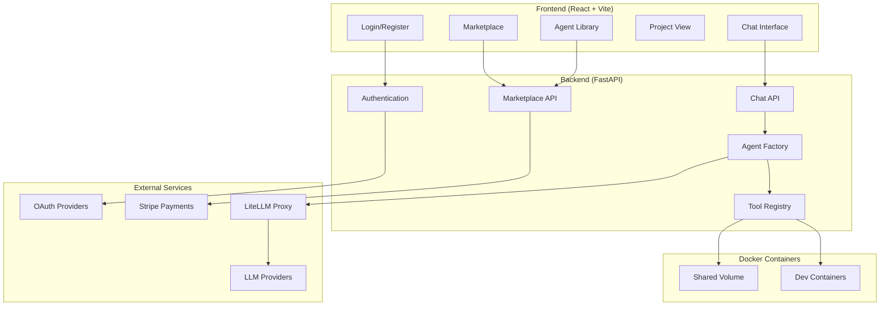
```mermaid
flowchart TB
    subgraph Frontend["Frontend (React + Vite)"]
        Login[Login/Register]
        Marketplace[Marketplace]
        Library[Agent Library]
        Project[Project View]
        Chat[Chat Interface]
    end

    subgraph Backend["Backend (FastAPI)"]
        Auth[Authentication]
        MarketplaceAPI[Marketplace API]
        ChatAPI[Chat API]
        AgentFactory[Agent Factory]
        ToolRegistry[Tool Registry]
    end

    subgraph External["External Services"]
        LiteLLM[LiteLLM Proxy]
        Stripe[Stripe Payments]
        OAuth[OAuth Providers]
        LLMProviders[LLM Providers]
    end

    subgraph Containers["Docker Containers"]
        DevContainer[Dev Containers]
        SharedVolume[Shared Volume]
    end

    Login --> Auth
    Auth --> OAuth
    Marketplace --> MarketplaceAPI
    MarketplaceAPI --> Stripe
    Library --> MarketplaceAPI
    Chat --> ChatAPI
    ChatAPI --> AgentFactory
    AgentFactory --> ToolRegistry
    ToolRegistry --> DevContainer
    ToolRegistry --> SharedVolume
    AgentFactory --> LiteLLM
    LiteLLM --> LLMProviders
```

---

## 2. User Authentication Flow

### 2.1 Local Authentication (Email/Password)

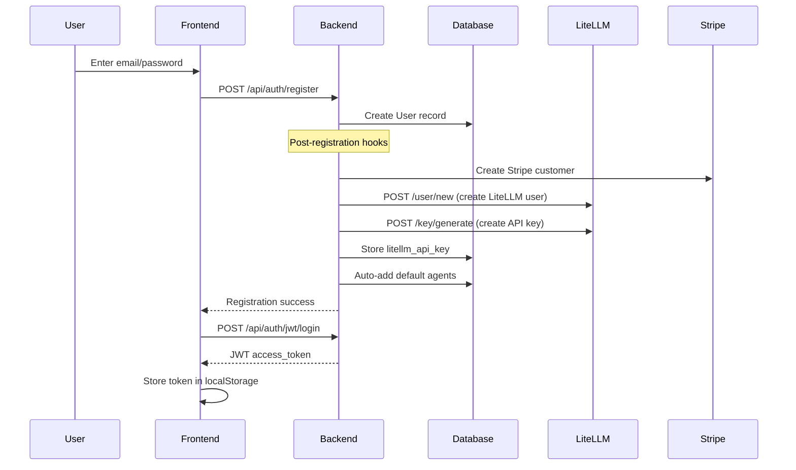
```mermaid
sequenceDiagram
    participant U as User
    participant F as Frontend
    participant B as Backend
    participant DB as Database
    participant L as LiteLLM
    participant S as Stripe

    U->>F: Enter email/password
    F->>B: POST /api/auth/register
    B->>DB: Create User record

    Note over B: Post-registration hooks
    B->>S: Create Stripe customer
    B->>L: POST /user/new (create LiteLLM user)
    B->>L: POST /key/generate (create API key)
    B->>DB: Store litellm_api_key
    B->>DB: Auto-add default agents

    B-->>F: Registration success
    F->>B: POST /api/auth/jwt/login
    B-->>F: JWT access_token
    F->>F: Store token in localStorage
```

### 2.2 OAuth Authentication (Google/GitHub)

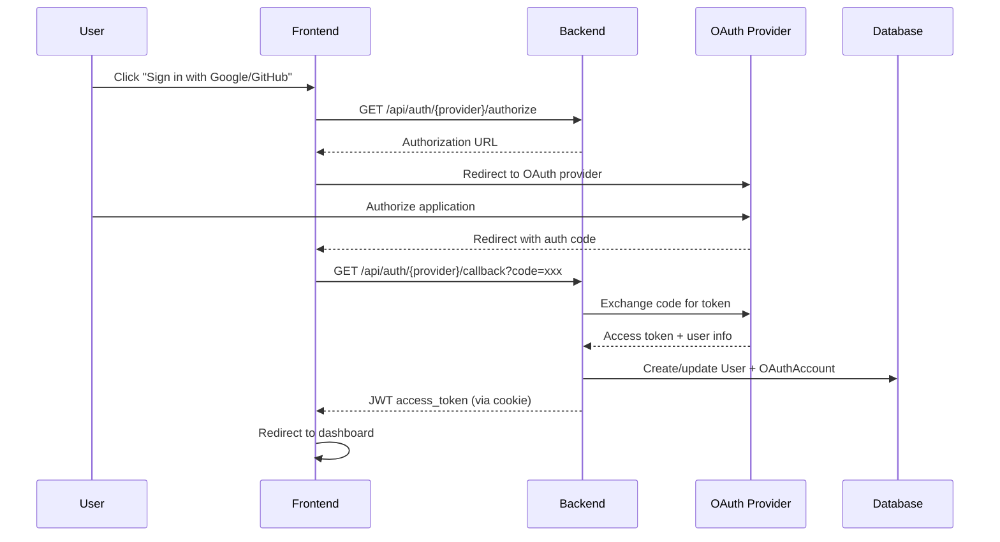
```mermaid
sequenceDiagram
    participant U as User
    participant F as Frontend
    participant B as Backend
    participant P as OAuth Provider
    participant DB as Database

    U->>F: Click "Sign in with Google/GitHub"
    F->>B: GET /api/auth/{provider}/authorize
    B-->>F: Authorization URL
    F->>P: Redirect to OAuth provider
    U->>P: Authorize application
    P-->>F: Redirect with auth code
    F->>B: GET /api/auth/{provider}/callback?code=xxx
    B->>P: Exchange code for token
    P-->>B: Access token + user info
    B->>DB: Create/update User + OAuthAccount
    B-->>F: JWT access_token (via cookie)
    F->>F: Redirect to dashboard
```

### 2.3 Authentication Model

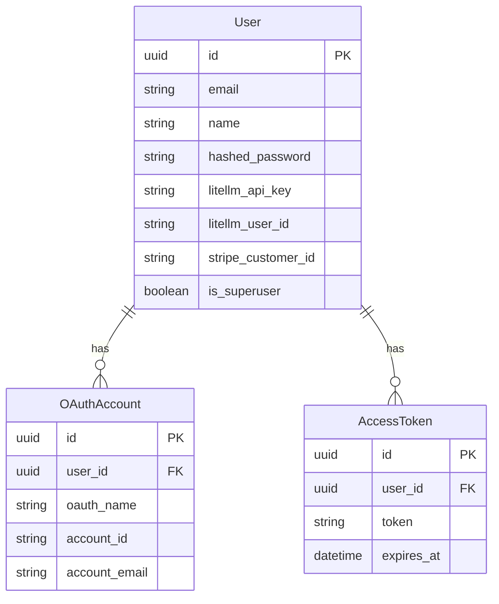
```mermaid
erDiagram
    User ||--o{ OAuthAccount : has
    User ||--o{ AccessToken : has
    User {
        uuid id PK
        string email
        string name
        string hashed_password
        string litellm_api_key
        string litellm_user_id
        string stripe_customer_id
        boolean is_superuser
    }
    OAuthAccount {
        uuid id PK
        uuid user_id FK
        string oauth_name
        string account_id
        string account_email
    }
    AccessToken {
        uuid id PK
        uuid user_id FK
        string token
        datetime expires_at
    }
```

---

## 3. LiteLLM Configuration

### 3.1 LiteLLM Architecture

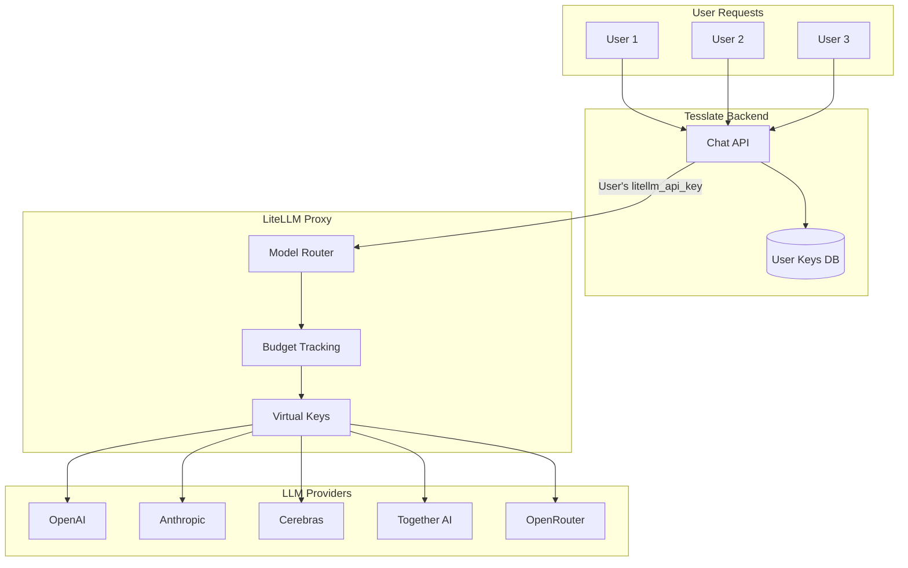
```mermaid
flowchart TB
    subgraph Users["User Requests"]
        U1[User 1]
        U2[User 2]
        U3[User 3]
    end

    subgraph Tesslate["Tesslate Backend"]
        API[Chat API]
        KeyStore[(User Keys DB)]
    end

    subgraph LiteLLMProxy["LiteLLM Proxy"]
        Router[Model Router]
        Budget[Budget Tracking]
        Keys[Virtual Keys]
    end

    subgraph Providers["LLM Providers"]
        OpenAI[OpenAI]
        Anthropic[Anthropic]
        Cerebras[Cerebras]
        Together[Together AI]
        OpenRouter[OpenRouter]
    end

    U1 --> API
    U2 --> API
    U3 --> API
    API --> KeyStore
    API -->|User's litellm_api_key| Router
    Router --> Budget
    Budget --> Keys
    Keys --> OpenAI
    Keys --> Anthropic
    Keys --> Cerebras
    Keys --> Together
    Keys --> OpenRouter
```

### 3.2 User Key Creation Flow

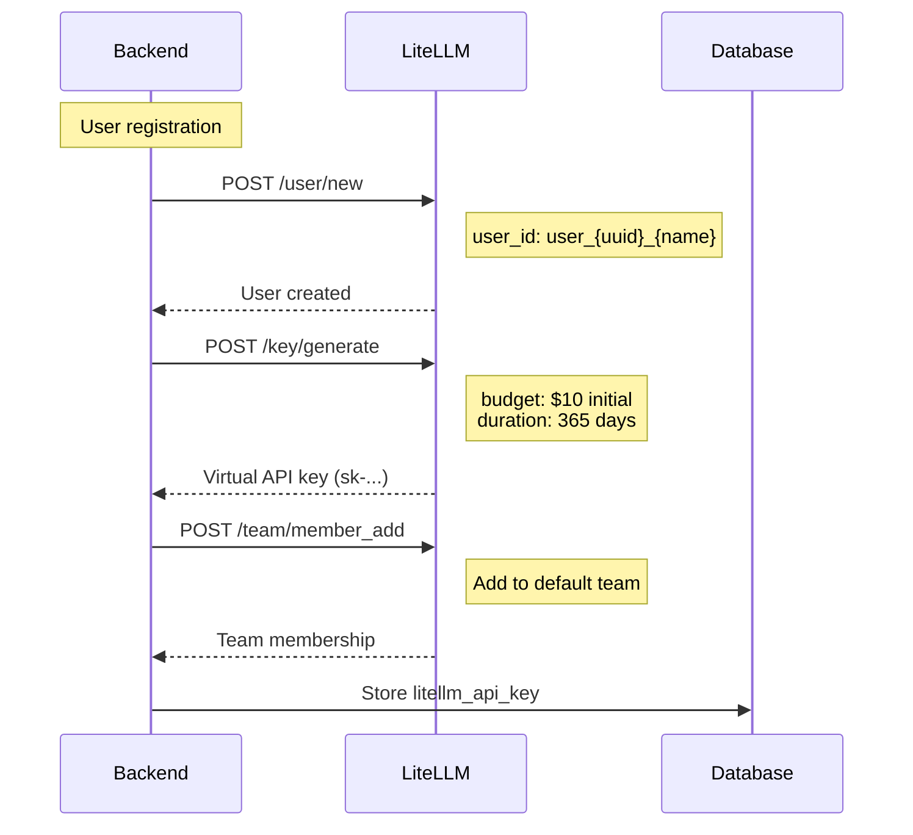
```mermaid
sequenceDiagram
    participant B as Backend
    participant L as LiteLLM
    participant DB as Database

    Note over B: User registration
    B->>L: POST /user/new
    Note right of L: user_id: user_{uuid}_{name}
    L-->>B: User created

    B->>L: POST /key/generate
    Note right of L: budget: $10 initial<br/>duration: 365 days
    L-->>B: Virtual API key (sk-...)

    B->>L: POST /team/member_add
    Note right of L: Add to default team
    L-->>B: Team membership

    B->>DB: Store litellm_api_key
```

### 3.3 Configuration Settings

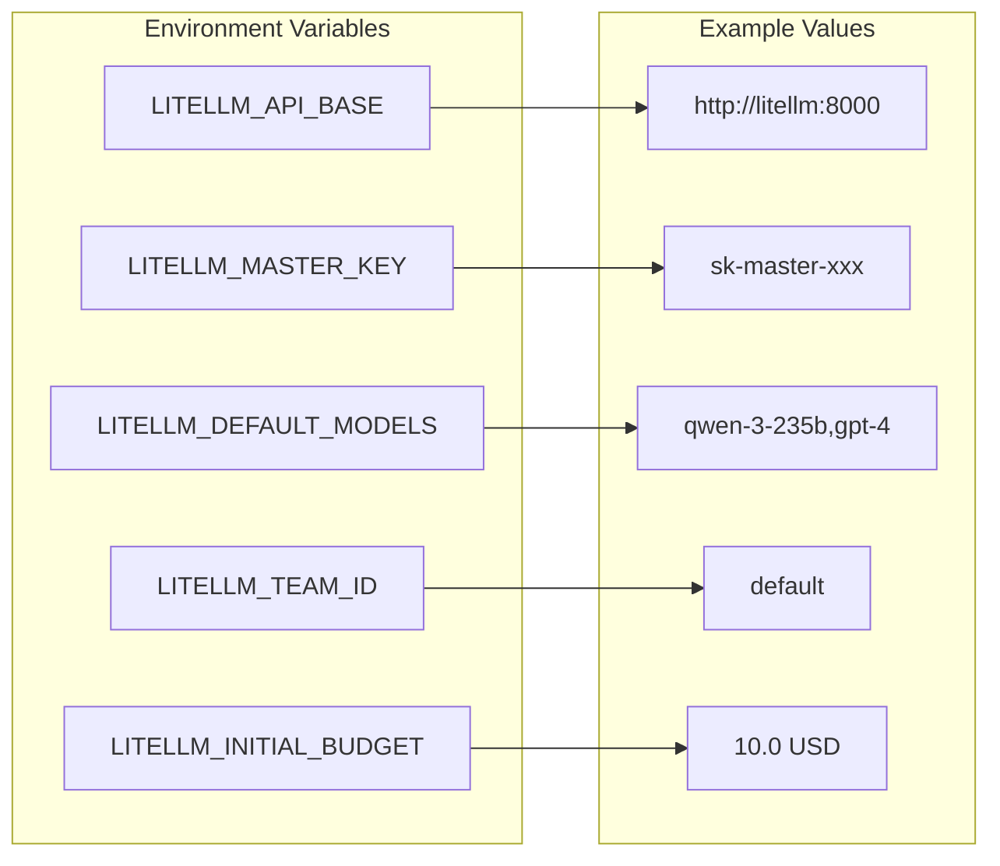
```mermaid
flowchart LR
    subgraph Config["Environment Variables"]
        A[LITELLM_API_BASE]
        B[LITELLM_MASTER_KEY]
        C[LITELLM_DEFAULT_MODELS]
        D[LITELLM_TEAM_ID]
        E[LITELLM_INITIAL_BUDGET]
    end

    subgraph Values["Example Values"]
        A1["http://litellm:8000"]
        B1["sk-master-xxx"]
        C1["qwen-3-235b,gpt-4"]
        D1["default"]
        E1["10.0 USD"]
    end

    A --> A1
    B --> B1
    C --> C1
    D --> D1
    E --> E1
```

---

## 4. Marketplace & Agent Purchasing

### 4.1 Marketplace Data Model

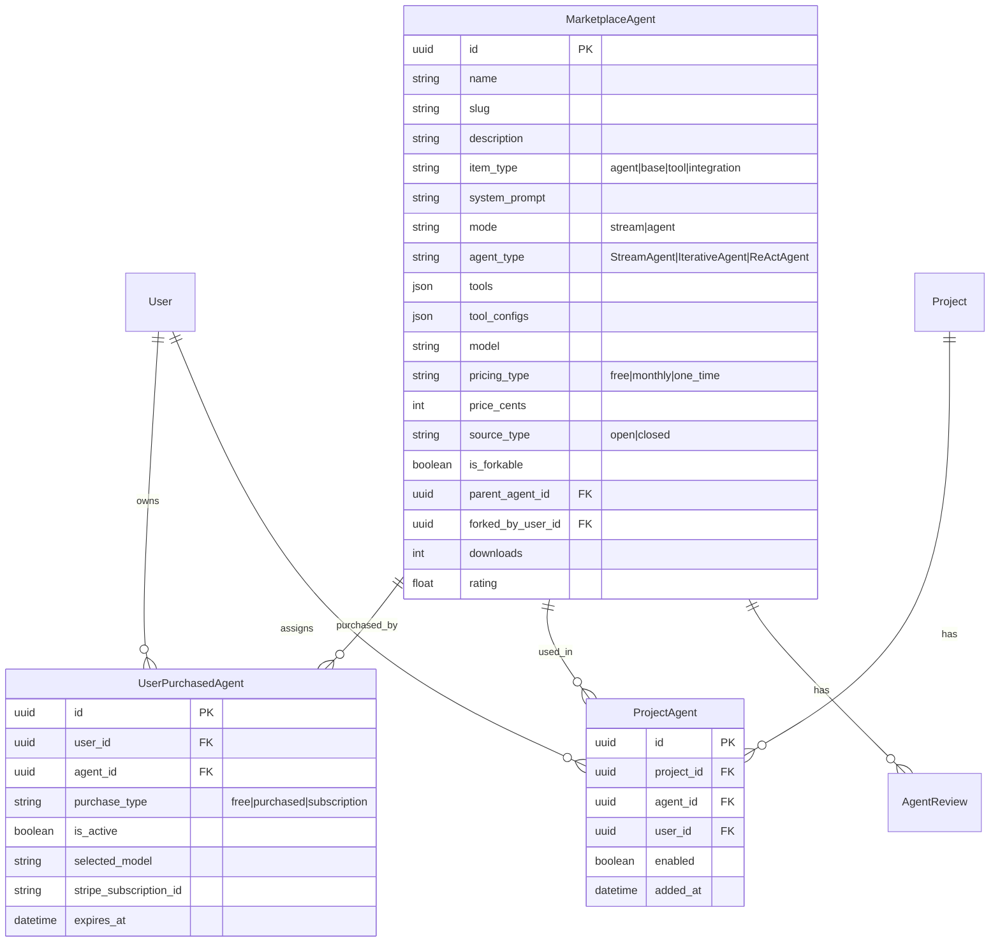
```mermaid
erDiagram
    MarketplaceAgent ||--o{ UserPurchasedAgent : purchased_by
    MarketplaceAgent ||--o{ ProjectAgent : used_in
    MarketplaceAgent ||--o{ AgentReview : has
    User ||--o{ UserPurchasedAgent : owns
    User ||--o{ ProjectAgent : assigns
    Project ||--o{ ProjectAgent : has

    MarketplaceAgent {
        uuid id PK
        string name
        string slug
        string description
        string item_type "agent|base|tool|integration"
        string system_prompt
        string mode "stream|agent"
        string agent_type "StreamAgent|IterativeAgent|ReActAgent"
        json tools
        json tool_configs
        string model
        string pricing_type "free|monthly|one_time"
        int price_cents
        string source_type "open|closed"
        boolean is_forkable
        uuid parent_agent_id FK
        uuid forked_by_user_id FK
        int downloads
        float rating
    }

    UserPurchasedAgent {
        uuid id PK
        uuid user_id FK
        uuid agent_id FK
        string purchase_type "free|purchased|subscription"
        boolean is_active
        string selected_model
        string stripe_subscription_id
        datetime expires_at
    }

    ProjectAgent {
        uuid id PK
        uuid project_id FK
        uuid agent_id FK
        uuid user_id FK
        boolean enabled
        datetime added_at
    }
```

### 4.2 Agent Purchase Flow

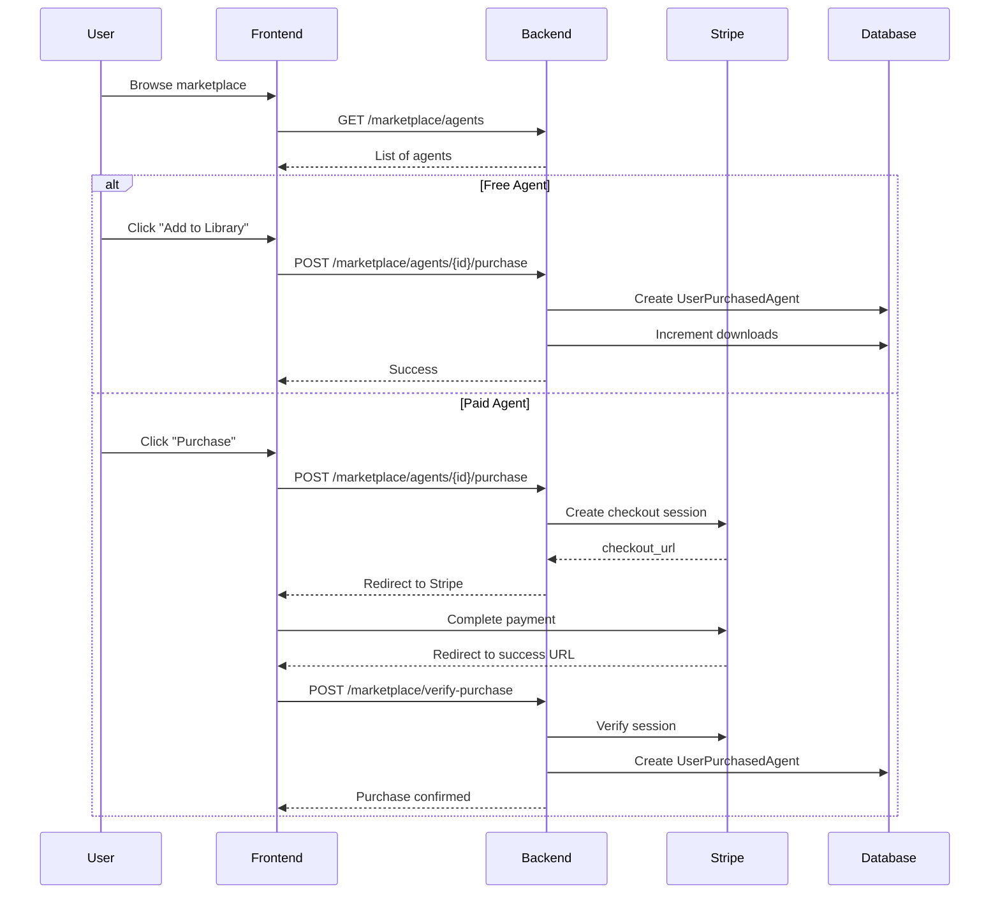
```mermaid
sequenceDiagram
    participant U as User
    participant F as Frontend
    participant B as Backend
    participant S as Stripe
    participant DB as Database

    U->>F: Browse marketplace
    F->>B: GET /marketplace/agents
    B-->>F: List of agents

    alt Free Agent
        U->>F: Click "Add to Library"
        F->>B: POST /marketplace/agents/{id}/purchase
        B->>DB: Create UserPurchasedAgent
        B->>DB: Increment downloads
        B-->>F: Success
    else Paid Agent
        U->>F: Click "Purchase"
        F->>B: POST /marketplace/agents/{id}/purchase
        B->>S: Create checkout session
        S-->>B: checkout_url
        B-->>F: Redirect to Stripe
        F->>S: Complete payment
        S-->>F: Redirect to success URL
        F->>B: POST /marketplace/verify-purchase
        B->>S: Verify session
        B->>DB: Create UserPurchasedAgent
        B-->>F: Purchase confirmed
    end
```

### 4.3 Agent Library Management

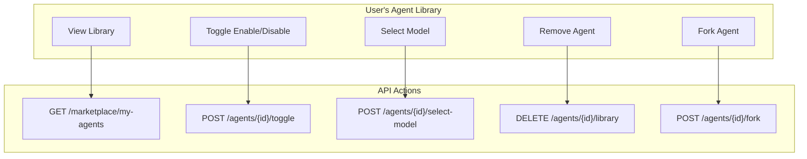
```mermaid
flowchart TB
    subgraph Library["User's Agent Library"]
        direction TB
        L1[View Library]
        L2[Toggle Enable/Disable]
        L3[Select Model]
        L4[Remove Agent]
        L5[Fork Agent]
    end

    subgraph Actions["API Actions"]
        A1["GET /marketplace/my-agents"]
        A2["POST /agents/{id}/toggle"]
        A3["POST /agents/{id}/select-model"]
        A4["DELETE /agents/{id}/library"]
        A5["POST /agents/{id}/fork"]
    end

    L1 --> A1
    L2 --> A2
    L3 --> A3
    L4 --> A4
    L5 --> A5
```

### 4.4 Adding Agents to Projects

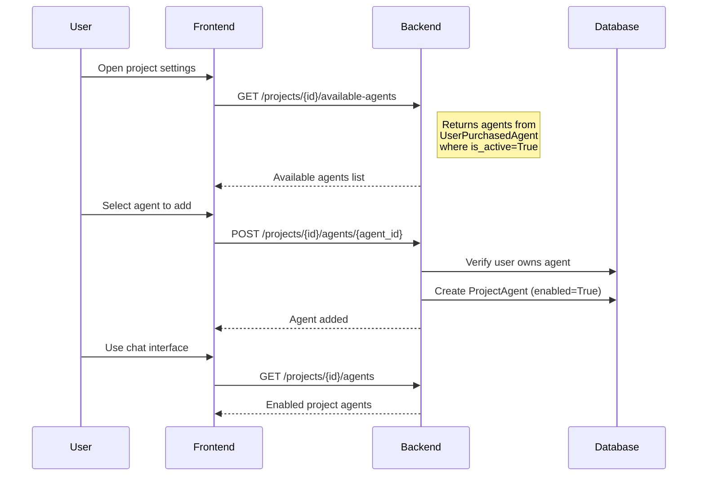
```mermaid
sequenceDiagram
    participant U as User
    participant F as Frontend
    participant B as Backend
    participant DB as Database

    U->>F: Open project settings
    F->>B: GET /projects/{id}/available-agents
    Note right of B: Returns agents from<br/>UserPurchasedAgent<br/>where is_active=True
    B-->>F: Available agents list

    U->>F: Select agent to add
    F->>B: POST /projects/{id}/agents/{agent_id}
    B->>DB: Verify user owns agent
    B->>DB: Create ProjectAgent (enabled=True)
    B-->>F: Agent added

    U->>F: Use chat interface
    F->>B: GET /projects/{id}/agents
    B-->>F: Enabled project agents
```

---

## 5. Agent Factory System

### 5.1 Factory Architecture

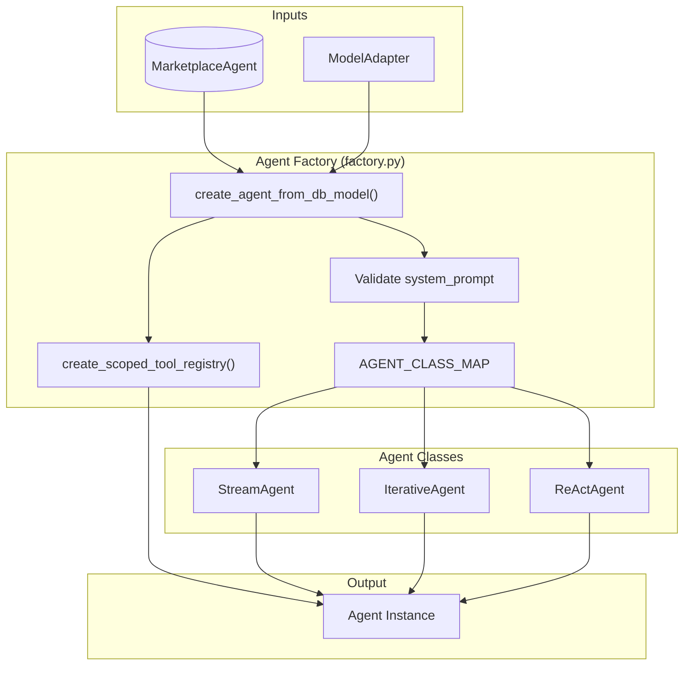
```mermaid
flowchart TB
    subgraph Factory["Agent Factory (factory.py)"]
        direction TB
        Create["create_agent_from_db_model()"]
        ClassMap["AGENT_CLASS_MAP"]
        Validate["Validate system_prompt"]
        ScopedTools["create_scoped_tool_registry()"]
    end

    subgraph AgentTypes["Agent Classes"]
        Stream[StreamAgent]
        Iterative[IterativeAgent]
        ReAct[ReActAgent]
    end

    subgraph Inputs["Inputs"]
        DBModel[(MarketplaceAgent)]
        ModelAdapter[ModelAdapter]
    end

    subgraph Output["Output"]
        Instance[Agent Instance]
    end

    DBModel --> Create
    ModelAdapter --> Create
    Create --> Validate
    Validate --> ClassMap
    ClassMap --> Stream
    ClassMap --> Iterative
    ClassMap --> ReAct
    Create --> ScopedTools
    ScopedTools --> Instance
    Stream --> Instance
    Iterative --> Instance
    ReAct --> Instance
```

### 5.2 Agent Class Map

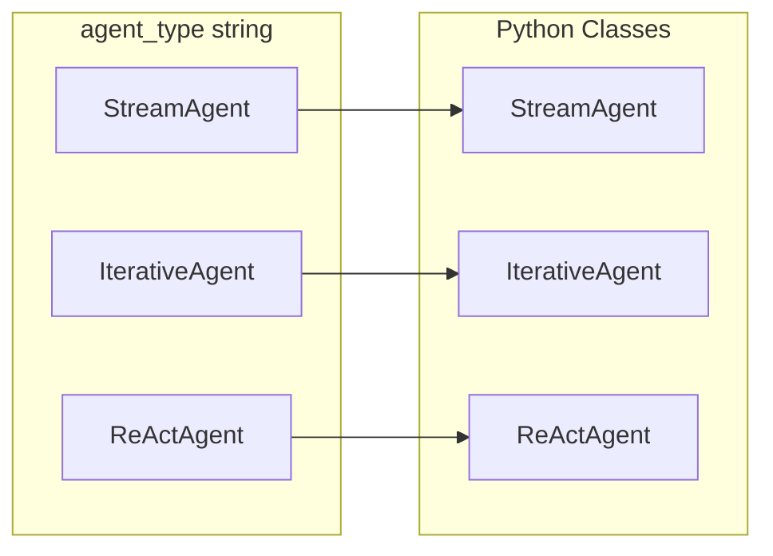
```mermaid
flowchart LR
    subgraph Input["agent_type string"]
        S1["StreamAgent"]
        S2["IterativeAgent"]
        S3["ReActAgent"]
    end

    subgraph Classes["Python Classes"]
        C1[StreamAgent]
        C2[IterativeAgent]
        C3[ReActAgent]
    end

    S1 --> C1
    S2 --> C2
    S3 --> C3
```

### 5.3 Factory Flow

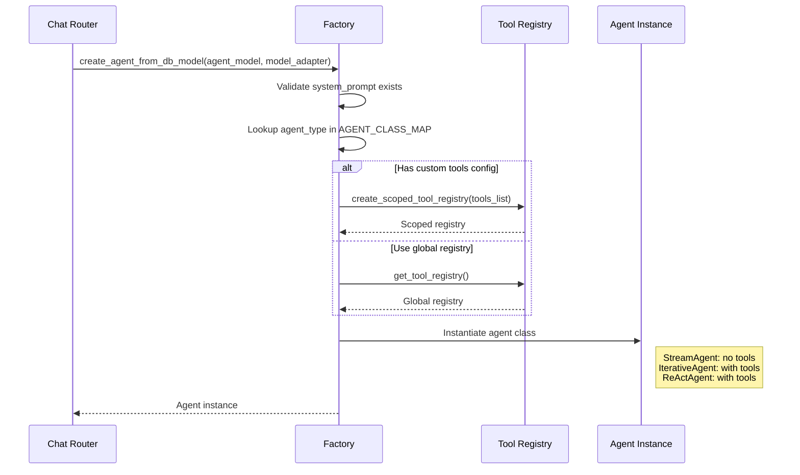
```mermaid
sequenceDiagram
    participant C as Chat Router
    participant F as Factory
    participant R as Tool Registry
    participant A as Agent Instance

    C->>F: create_agent_from_db_model(agent_model, model_adapter)

    F->>F: Validate system_prompt exists
    F->>F: Lookup agent_type in AGENT_CLASS_MAP

    alt Has custom tools config
        F->>R: create_scoped_tool_registry(tools_list)
        R-->>F: Scoped registry
    else Use global registry
        F->>R: get_tool_registry()
        R-->>F: Global registry
    end

    F->>A: Instantiate agent class
    Note right of A: StreamAgent: no tools<br/>IterativeAgent: with tools<br/>ReActAgent: with tools

    F-->>C: Agent instance
```

---

## 6. Agent Types

### 6.1 Agent Type Comparison

```mermaid
flowchart TB
    subgraph StreamAgent["StreamAgent"]
        direction TB
        S1["Single Pass"]
        S2["No Tools"]
        S3["Direct LLM Streaming"]
        S4["Code Extraction"]
        S5["File Auto-Save"]
    end

    subgraph IterativeAgent["IterativeAgent (Tesslate Agent)"]
        direction TB
        I1["Multi-Iteration Loop"]
        I2["Full Tool Support"]
        I3["Think-Act-Reflect"]
        I4["Approval System"]
        I5["Resource Limits"]
    end

    subgraph ReActAgent["ReActAgent"]
        direction TB
        R1["Multi-Iteration Loop"]
        R2["Full Tool Support"]
        R3["Explicit THOUGHT"]
        R4["Same as Iterative"]
        R5["ReAct Prompting"]
    end
```

### 6.2 StreamAgent Flow

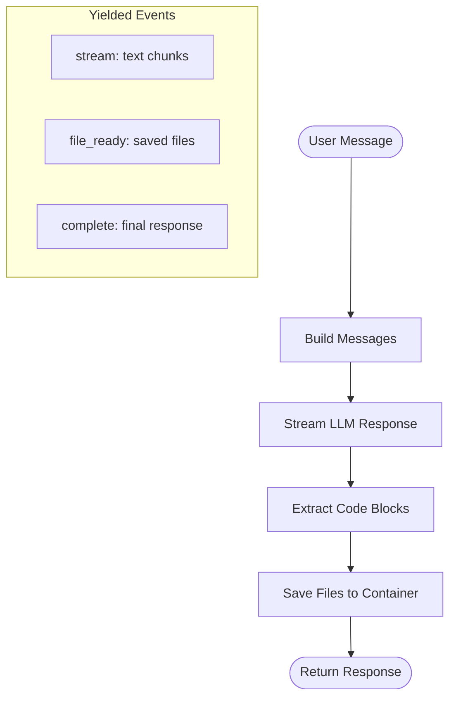
```mermaid
flowchart TB
    Start([User Message]) --> Build[Build Messages]
    Build --> Stream[Stream LLM Response]
    Stream --> Extract[Extract Code Blocks]
    Extract --> Save[Save Files to Container]
    Save --> Complete([Return Response])

    subgraph Events["Yielded Events"]
        E1["stream: text chunks"]
        E2["file_ready: saved files"]
        E3["complete: final response"]
    end
```

### 6.3 IterativeAgent/ReActAgent Loop

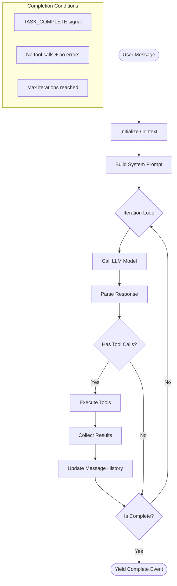
```mermaid
flowchart TB
    Start([User Message]) --> Init[Initialize Context]
    Init --> Build[Build System Prompt]
    Build --> Loop{Iteration Loop}

    Loop --> Model[Call LLM Model]
    Model --> Parse[Parse Response]
    Parse --> Tools{Has Tool Calls?}

    Tools -->|Yes| Execute[Execute Tools]
    Execute --> Results[Collect Results]
    Results --> History[Update Message History]
    History --> Complete{Is Complete?}

    Tools -->|No| Complete

    Complete -->|No| Loop
    Complete -->|Yes| Finish([Yield Complete Event])

    subgraph Completion["Completion Conditions"]
        C1["TASK_COMPLETE signal"]
        C2["No tool calls + no errors"]
        C3["Max iterations reached"]
    end
```

---

## 7. The Agent Loop (IterativeAgent)

### 7.1 Detailed Iteration Flow

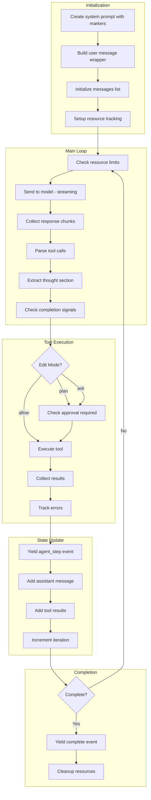
```mermaid
flowchart TB
    subgraph Init["Initialization"]
        I1[Create system prompt with markers]
        I2[Build user message wrapper]
        I3[Initialize messages list]
        I4[Setup resource tracking]
    end

    subgraph Loop["Main Loop"]
        L1[Check resource limits]
        L2[Send to model - streaming]
        L3[Collect response chunks]
        L4[Parse tool calls]
        L5[Extract thought section]
        L6[Check completion signals]
    end

    subgraph ToolExec["Tool Execution"]
        T1{Edit Mode?}
        T2[Check approval required]
        T3[Execute tool]
        T4[Collect results]
        T5[Track errors]
    end

    subgraph Update["State Update"]
        U1[Yield agent_step event]
        U2[Add assistant message]
        U3[Add tool results]
        U4[Increment iteration]
    end

    subgraph End["Completion"]
        E1{Complete?}
        E2[Yield complete event]
        E3[Cleanup resources]
    end

    I1 --> I2 --> I3 --> I4 --> L1
    L1 --> L2 --> L3 --> L4 --> L5 --> L6
    L6 --> T1
    T1 -->|plan| T2
    T1 -->|ask| T2
    T1 -->|allow| T3
    T2 --> T3 --> T4 --> T5
    T5 --> U1 --> U2 --> U3 --> U4
    U4 --> E1
    E1 -->|No| L1
    E1 -->|Yes| E2 --> E3
```

### 7.2 Message History Structure

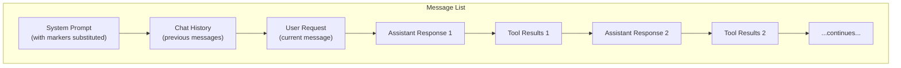
```mermaid
flowchart TB
    subgraph Messages["Message List"]
        M1["System Prompt<br/>(with markers substituted)"]
        M2["Chat History<br/>(previous messages)"]
        M3["User Request<br/>(current message)"]
        M4["Assistant Response 1"]
        M5["Tool Results 1"]
        M6["Assistant Response 2"]
        M7["Tool Results 2"]
        M8["...continues..."]
    end

    M1 --> M2 --> M3 --> M4 --> M5 --> M6 --> M7 --> M8
```

### 7.3 Event Types Yielded

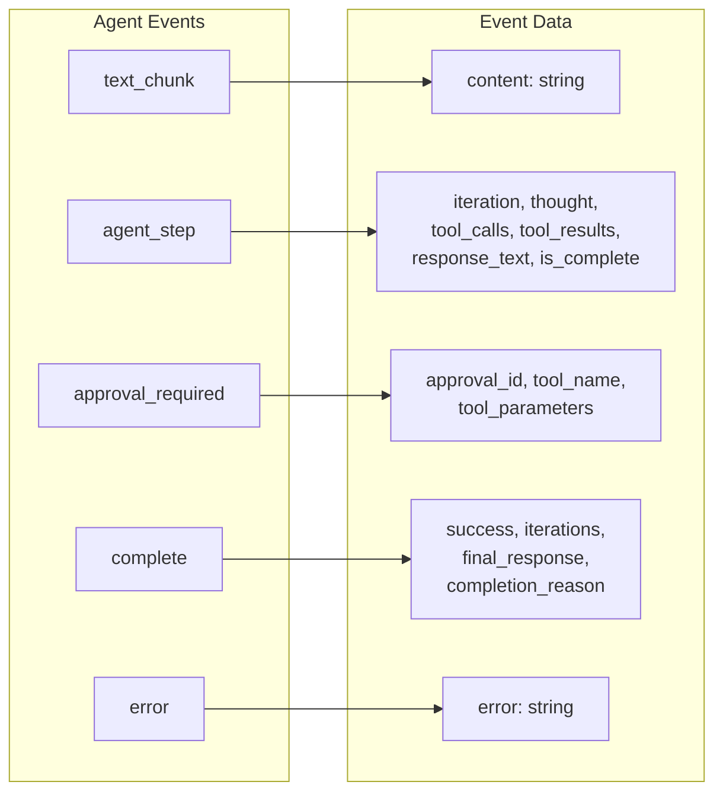
```mermaid
flowchart LR
    subgraph Events["Agent Events"]
        E1["text_chunk"]
        E2["agent_step"]
        E3["approval_required"]
        E4["complete"]
        E5["error"]
    end

    subgraph Data["Event Data"]
        D1["content: string"]
        D2["iteration, thought,<br/>tool_calls, tool_results,<br/>response_text, is_complete"]
        D3["approval_id, tool_name,<br/>tool_parameters"]
        D4["success, iterations,<br/>final_response,<br/>completion_reason"]
        D5["error: string"]
    end

    E1 --> D1
    E2 --> D2
    E3 --> D3
    E4 --> D4
    E5 --> D5
```

### 7.4 Completion Signals

```mermaid
flowchart TB
    subgraph Signals["Completion Signals (case-insensitive)"]
        S1["TASK_COMPLETE"]
        S2["COMPLETE_TASK_AND_SUBMIT_FINAL_OUTPUT"]
        S3["&lt;task_complete&gt;"]
        S4["&lt;!-- TASK COMPLETE --&gt;"]
    end

    subgraph Check["is_complete() check"]
        C1[Parse response text]
        C2{Contains signal?}
        C3[Return True]
        C4[Return False]
    end

    S1 --> C1
    S2 --> C1
    S3 --> C1
    S4 --> C1
    C1 --> C2
    C2 -->|Yes| C3
    C2 -->|No| C4
```

---

## 8. Tool Registry System

### 8.1 Registry Architecture

```mermaid
flowchart TB
    subgraph Registry["ToolRegistry"]
        direction TB
        Tools[(Tools Dict)]
        Register["register(tool)"]
        Get["get(name)"]
        List["list_tools(category)"]
        Execute["execute(name, params, context)"]
        Prompt["get_system_prompt_section()"]
    end

    subgraph Tool["Tool Dataclass"]
        T1[name: str]
        T2[description: str]
        T3[parameters: JSON Schema]
        T4[executor: async function]
        T5[category: ToolCategory]
        T6[examples: list]
    end

    subgraph Categories["ToolCategory Enum"]
        C1[FILE_OPS]
        C2[SHELL]
        C3[PROJECT]
        C4[BUILD]
        C5[WEB]
        C6[PLANNING]
    end

    Register --> Tools
    Get --> Tools
    List --> Tools
    Tool --> Register
    Categories --> Tool
```

### 8.2 Tool Execution Flow

```mermaid
sequenceDiagram
    participant A as Agent
    participant R as Registry
    participant M as ApprovalManager
    participant T as Tool Executor

    A->>R: execute(tool_name, params, context)
    R->>R: Get tool from registry

    alt Edit Mode = PLAN
        R-->>A: Error: Tool blocked in plan mode
    else Edit Mode = ASK
        R->>M: is_tool_approved(session_id, tool_name)?
        alt Not approved
            R-->>A: approval_required response
        else Approved
            R->>T: executor(params, context)
            T-->>R: Result
            R-->>A: Tool result
        end
    else Edit Mode = ALLOW
        R->>T: executor(params, context)
        T-->>R: Result
        R-->>A: Tool result
    end
```

### 8.3 Global vs Scoped Registry

```mermaid
flowchart TB
    subgraph Global["Global Registry"]
        G1[All 12 tools]
        G2[Default for all agents]
    end

    subgraph Scoped["Scoped Registry"]
        S1[Subset of tools]
        S2[Per-agent configuration]
        S3[Based on agent.tools field]
    end

    subgraph Example["Example: Read-only Agent"]
        E1[read_file]
        E2[get_project_info]
        E3[todo_read]
    end

    Global -->|create_scoped_tool_registry| Scoped
    Scoped --> Example
```

---

## 9. All Built-in Tools

### 9.1 Tool Categories Overview

```mermaid
flowchart TB
    subgraph FileOps["FILE_OPS (4 tools)"]
        F1["read_file<br/>Read file content"]
        F2["write_file<br/>Write new file"]
        F3["patch_file<br/>Partial edit"]
        F4["multi_edit<br/>Multiple edits"]
    end

    subgraph Shell["SHELL (4 tools)"]
        S1["bash_exec<br/>One-off command"]
        S2["shell_open<br/>Open session"]
        S3["shell_close<br/>Close session"]
        S4["shell_exec<br/>Execute in session"]
    end

    subgraph Project["PROJECT (1 tool)"]
        P1["get_project_info<br/>Project metadata"]
    end

    subgraph Planning["PLANNING (2 tools)"]
        PL1["todo_read<br/>Read task list"]
        PL2["todo_write<br/>Update task list"]
    end

    subgraph Web["WEB (1 tool)"]
        W1["web_fetch<br/>Fetch URL content"]
    end
```

### 9.2 File Operations Tools

```mermaid
flowchart TB
    subgraph ReadFile["read_file"]
        RF1["Input: file_path"]
        RF2["Reads from shared volume"]
        RF3["Falls back to database"]
        RF4["Returns: content, size, lines"]
    end

    subgraph WriteFile["write_file"]
        WF1["Input: file_path, content"]
        WF2["Writes to shared volume"]
        WF3["Also saves to database"]
        WF4["Returns: preview, size"]
    end

    subgraph PatchFile["patch_file"]
        PF1["Input: file_path, patches[]"]
        PF2["Each patch: old_text, new_text"]
        PF3["Atomic replacement"]
        PF4["Returns: changes made"]
    end

    subgraph MultiEdit["multi_edit"]
        ME1["Input: edits[]"]
        ME2["Each edit: file_path, patches"]
        ME3["Multiple files at once"]
        ME4["Returns: files modified"]
    end
```

### 9.3 Shell Operations Tools

```mermaid
flowchart TB
    subgraph BashExec["bash_exec"]
        B1["Input: command, timeout"]
        B2["Auto-manages session"]
        B3["Opens, executes, closes"]
        B4["Returns: stdout, stderr, exit_code"]
    end

    subgraph ShellOpen["shell_open"]
        SO1["Input: command (default /bin/sh)"]
        SO2["Creates PTY session"]
        SO3["Returns: session_id"]
        SO4["Session persists until closed"]
    end

    subgraph ShellExec["shell_exec"]
        SE1["Input: session_id, command"]
        SE2["Executes in existing session"]
        SE3["Maintains state (cd, env)"]
        SE4["Returns: output"]
    end

    subgraph ShellClose["shell_close"]
        SC1["Input: session_id"]
        SC2["Closes PTY session"]
        SC3["Frees resources"]
    end
```

### 9.4 Tool Parameter Schemas

```mermaid
flowchart LR
    subgraph read_file
        R1["file_path: string (required)"]
    end

    subgraph write_file
        W1["file_path: string (required)"]
        W2["content: string (required)"]
    end

    subgraph patch_file
        P1["file_path: string (required)"]
        P2["patches: array (required)"]
        P3["  - old_text: string"]
        P4["  - new_text: string"]
    end

    subgraph bash_exec
        B1["command: string (required)"]
        B2["timeout: integer (optional, default 60s)"]
    end

    subgraph web_fetch
        WF1["url: string (required)"]
        WF2["prompt: string (optional)"]
    end
```

---

## 10. Container-Scoped vs Project-Level Agents

### 10.1 Scope Comparison

```mermaid
flowchart TB
    subgraph ProjectLevel["Project-Level Agent"]
        PL1["No container_id"]
        PL2["Sees all directories"]
        PL3["Files at /projects/slug/"]
        PL4["container/file.js"]
        PL5["other-container/file.js"]
    end

    subgraph ContainerLevel["Container-Scoped Agent"]
        CL1["Has container_id"]
        CL2["Sees only container files"]
        CL3["Files appear at root /"]
        CL4["file.js (actually container/file.js)"]
        CL5["Other containers hidden"]
    end
```

### 10.2 Container Directory Resolution

```mermaid
sequenceDiagram
    participant F as Frontend
    participant B as Backend
    participant DB as Database
    participant V as VolumeManager

    F->>B: Chat message with container_id
    B->>DB: SELECT Container WHERE id = container_id
    DB-->>B: Container { directory: "frontend" }

    Note over B: Set container_directory = "frontend"

    B->>B: Build execution context
    Note over B: context.container_directory = "frontend"

    Note over B: Agent calls read_file("app/page.tsx")

    B->>V: read_file("project-slug", "app/page.tsx", subdir="frontend")
    Note over V: Actual path: /projects/project-slug/frontend/app/page.tsx
    V-->>B: File content
```

### 10.3 File Path Translation

```mermaid
flowchart LR
    subgraph AgentView["What Agent Sees"]
        A1["app/page.tsx"]
        A2["package.json"]
        A3["src/index.js"]
    end

    subgraph ActualPath["Actual Storage Path"]
        P1["/projects/slug/frontend/app/page.tsx"]
        P2["/projects/slug/frontend/package.json"]
        P3["/projects/slug/frontend/src/index.js"]
    end

    subgraph Subdir["container_directory = frontend"]
        S1["Prefixes all paths"]
    end

    A1 -->|+ subdir| P1
    A2 -->|+ subdir| P2
    A3 -->|+ subdir| P3
```

---

## 11. Edit Mode System

### 11.1 Mode Comparison

```mermaid
flowchart TB
    subgraph Plan["PLAN Mode"]
        P1["Read-only access"]
        P2["Can: read_file, get_project_info"]
        P3["Cannot: write, patch, bash, shell"]
        P4["Agent proposes changes"]
        P5["User implements manually"]
    end

    subgraph Ask["ASK Mode (Default)"]
        A1["Approval required for dangerous ops"]
        A2["Can read freely"]
        A3["Write/execute needs approval"]
        A4["User sees approval modal"]
        A5["Allow Once / Allow All / Stop"]
    end

    subgraph Allow["ALLOW Mode"]
        L1["Full access"]
        L2["No approval needed"]
        L3["All tools available"]
        L4["Use with caution"]
    end
```

### 11.2 Approval Flow

```mermaid
sequenceDiagram
    participant A as Agent
    participant R as Registry
    participant M as ApprovalManager
    participant F as Frontend
    participant U as User

    A->>R: execute("write_file", params)
    R->>R: Check edit_mode = "ask"
    R->>M: is_tool_approved("write_file")?
    M-->>R: Not approved

    R-->>A: approval_required response
    A-->>F: Yield approval_required event
    F->>U: Show approval modal

    alt User clicks "Allow Once"
        U->>F: allow_once
        F->>M: respond_to_approval(id, "allow_once")
        M->>A: Resume with one-time approval
    else User clicks "Allow All"
        U->>F: allow_all
        F->>M: respond_to_approval(id, "allow_all")
        Note over M: Mark tool approved for session
        M->>A: Resume, future calls auto-approved
    else User clicks "Stop"
        U->>F: stop
        F->>M: respond_to_approval(id, "stop")
        M->>A: Abort operation
    end
```

### 11.3 Blocked Tools by Mode

```mermaid
flowchart TB
    subgraph PlanBlocked["Blocked in PLAN Mode"]
        B1[write_file]
        B2[patch_file]
        B3[multi_edit]
        B4[bash_exec]
        B5[shell_exec]
        B6[shell_open]
        B7[web_fetch]
    end

    subgraph AskApproval["Need Approval in ASK Mode"]
        A1[write_file]
        A2[patch_file]
        A3[multi_edit]
        A4[bash_exec]
        A5[shell_exec]
    end

    subgraph AlwaysAllowed["Always Allowed"]
        AA1[read_file]
        AA2[get_project_info]
        AA3[todo_read]
        AA4[todo_write]
    end
```

---

## 12. Model Adapters

### 12.1 Adapter Architecture

```mermaid
flowchart TB
    subgraph Abstract["ModelAdapter (Abstract)"]
        A1["chat(messages) -> AsyncGenerator"]
        A2["Yields text chunks"]
    end

    subgraph OpenAI["OpenAIAdapter"]
        O1["OpenAI API"]
        O2["OpenRouter"]
        O3["Cerebras"]
        O4["Together AI"]
        O5["LiteLLM Proxy"]
    end

    subgraph Anthropic["AnthropicAdapter"]
        AN1["Anthropic API"]
        AN2["Claude models"]
    end

    Abstract --> OpenAI
    Abstract --> Anthropic
```

### 12.2 Model Routing

```mermaid
flowchart TB
    Start([Model Name]) --> Check{Provider?}

    Check -->|openrouter/*| OpenRouter["Use OpenRouter API<br/>with user's key"]
    Check -->|anthropic/*| Anthropic["Use Anthropic API<br/>via LiteLLM"]
    Check -->|Other| LiteLLM["Use LiteLLM Proxy<br/>with user's litellm_api_key"]

    OpenRouter --> Client[Create AsyncOpenAI client]
    Anthropic --> Client
    LiteLLM --> Client

    Client --> Adapter[Create ModelAdapter]
```

### 12.3 Streaming Response

```mermaid
sequenceDiagram
    participant A as Agent
    participant M as ModelAdapter
    participant L as LLM Provider

    A->>M: chat(messages)
    M->>L: Stream request

    loop While streaming
        L-->>M: Text chunk
        M-->>A: Yield chunk
        A-->>A: Accumulate response
    end

    L-->>M: Stream complete
    M-->>A: Generator exhausted
    A->>A: Parse full response
```

---

## 13. Complete Execution Flow

### 13.1 End-to-End Flow

```mermaid
flowchart TB
    subgraph User["User Actions"]
        U1[Login/Register]
        U2[Browse Marketplace]
        U3[Add Agent to Library]
        U4[Add Agent to Project]
        U5[Send Chat Message]
    end

    subgraph Auth["Authentication"]
        A1[Verify JWT]
        A2[Load User]
        A3[Get LiteLLM key]
    end

    subgraph Setup["Agent Setup"]
        S1[Load MarketplaceAgent]
        S2[Get user's selected_model]
        S3[Create ModelAdapter]
        S4[Create Tool Registry]
        S5[Instantiate Agent via Factory]
    end

    subgraph Context["Build Context"]
        C1[project_id, project_slug]
        C2[container_directory]
        C3[chat_history]
        C4[edit_mode]
        C5[project_context]
    end

    subgraph Exec["Agent Execution"]
        E1[Substitute prompt markers]
        E2[Build messages]
        E3[Enter iteration loop]
        E4[Call LLM]
        E5[Parse tool calls]
        E6[Execute tools]
        E7[Update history]
        E8[Check completion]
    end

    subgraph Output["Response"]
        O1[Yield events to WebSocket/SSE]
        O2[Save to database]
        O3[Display in UI]
    end

    U1 --> A1
    U2 --> U3 --> U4 --> U5
    U5 --> A1 --> A2 --> A3
    A3 --> S1 --> S2 --> S3 --> S4 --> S5
    S5 --> C1 --> C2 --> C3 --> C4 --> C5
    C5 --> E1 --> E2 --> E3 --> E4 --> E5 --> E6 --> E7 --> E8
    E8 -->|Not complete| E4
    E8 -->|Complete| O1 --> O2 --> O3
```

### 13.2 WebSocket Message Flow

```mermaid
sequenceDiagram
    participant U as User
    participant F as Frontend
    participant WS as WebSocket
    participant B as Backend
    participant A as Agent

    U->>F: Type message
    F->>WS: Connect /ws/{token}
    WS->>B: Validate token
    B-->>WS: Connection accepted

    F->>WS: Send message JSON
    Note right of WS: {message, project_id,<br/>container_id, agent_id,<br/>edit_mode}

    WS->>B: handle_chat_message()
    B->>B: Build execution context
    B->>A: agent.run(message, context)

    loop Agent iteration
        A-->>B: Yield event
        B-->>WS: Send JSON event
        WS-->>F: Display update
    end

    A-->>B: Yield complete
    B-->>WS: Send complete event
    WS-->>F: Display final response
    B->>B: Save to database
```

### 13.3 SSE Streaming Flow (Alternative)

```mermaid
sequenceDiagram
    participant F as Frontend
    participant B as Backend
    participant A as Agent

    F->>B: POST /api/chat/agent/stream
    Note right of F: {project_id, message,<br/>container_id, agent_id,<br/>edit_mode}

    B->>B: Build execution context
    B->>A: agent.run(message, context)

    loop Agent iteration
        A-->>B: Yield event
        B-->>F: SSE: data: {event JSON}
    end

    A-->>B: Yield complete
    B-->>F: SSE: data: {complete event}
    B->>B: Save to database
```

---

## Key Files Reference

| Component | File Path |
|-----------|-----------|
| Agent Factory | `orchestrator/app/agent/factory.py` |
| Base Agent | `orchestrator/app/agent/base.py` |
| IterativeAgent | `orchestrator/app/agent/iterative_agent.py` |
| StreamAgent | `orchestrator/app/agent/stream_agent.py` |
| ReActAgent | `orchestrator/app/agent/react_agent.py` |
| Tool Registry | `orchestrator/app/agent/tools/registry.py` |
| File Tools | `orchestrator/app/agent/tools/file_ops/` |
| Shell Tools | `orchestrator/app/agent/tools/shell_ops/` |
| Response Parser | `orchestrator/app/agent/parser.py` |
| Prompt Markers | `orchestrator/app/agent/prompts.py` |
| Model Adapters | `orchestrator/app/agent/models.py` |
| Chat Router | `orchestrator/app/routers/chat.py` |
| Marketplace Router | `orchestrator/app/routers/marketplace.py` |
| User Auth | `orchestrator/app/users.py` |
| OAuth Config | `orchestrator/app/oauth.py` |
| LiteLLM Service | `orchestrator/app/services/litellm_service.py` |
| Volume Manager | `orchestrator/app/services/volume_manager.py` |
| PTY Broker | `orchestrator/app/services/pty_broker.py` |
| Shell Session Manager | `orchestrator/app/services/shell_session_manager.py` |
